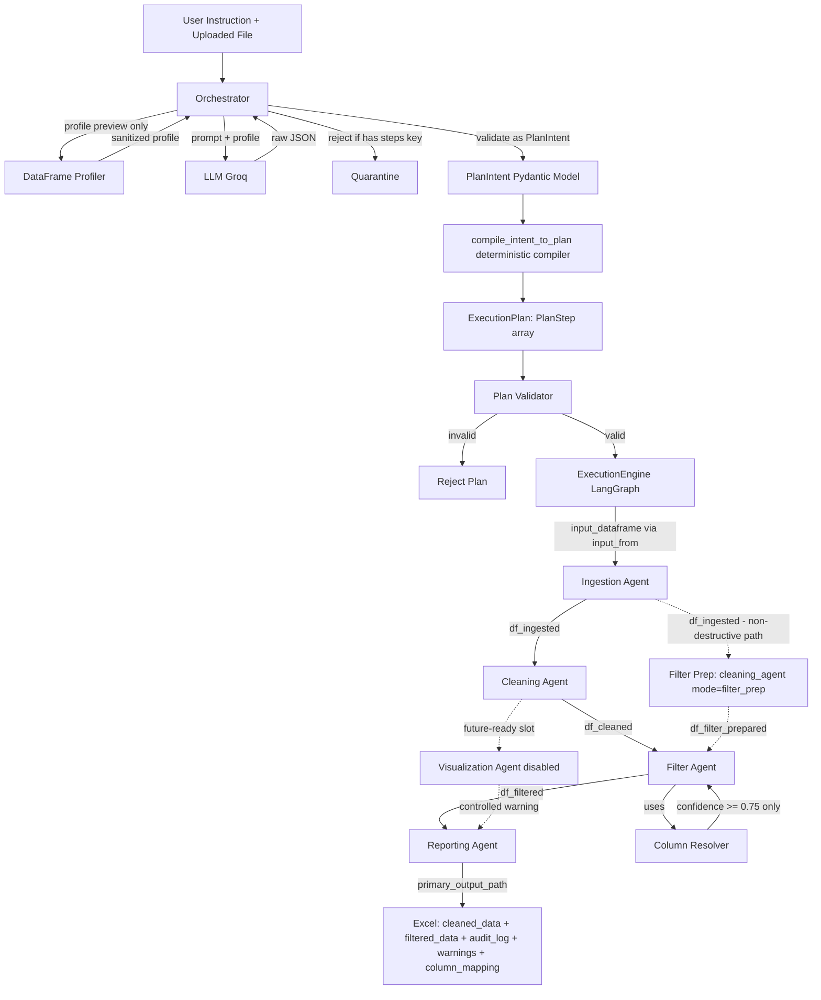
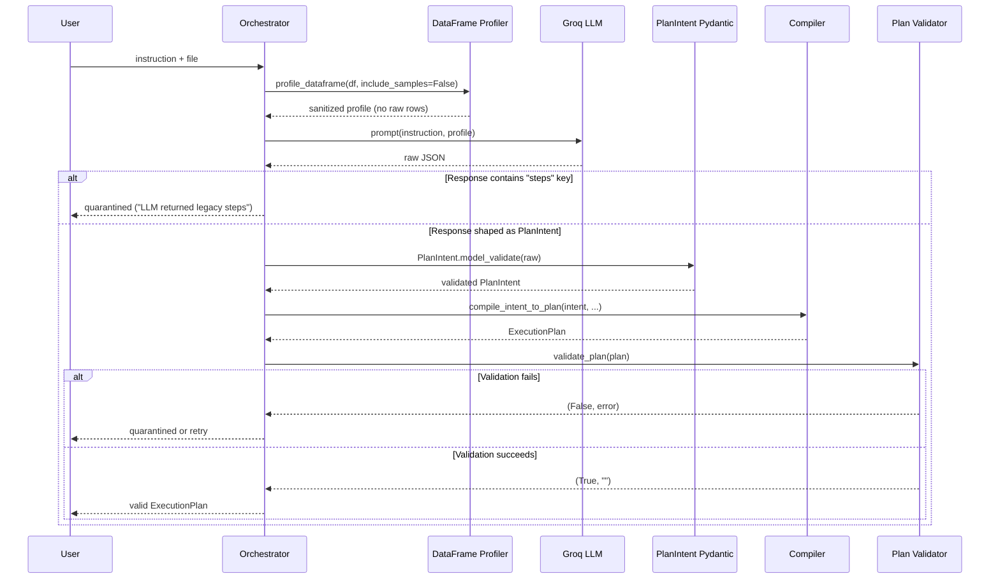
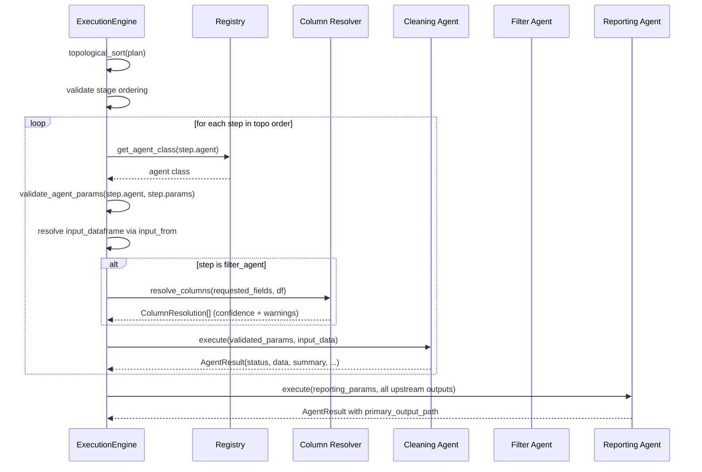
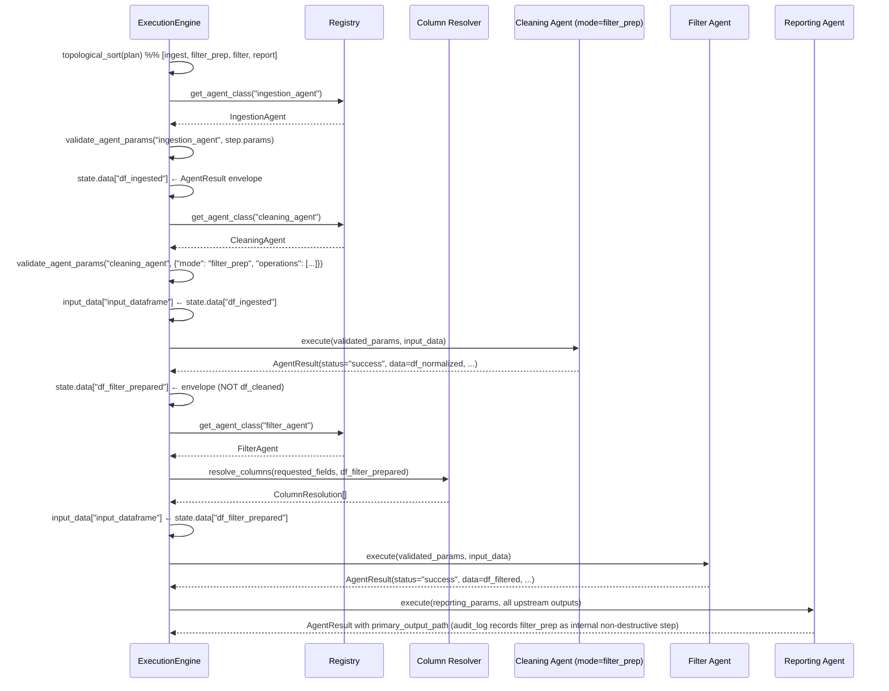

# Design Document: Agent Pipeline Hardening

## Overview

This feature hardens the FinFlow Agent Service pipeline so it stays focused on cleaning and filtering today, while strictly following a format that can safely add visualization later without rewriting or breaking existing agents. The work preserves the existing `PlanIntent → compile_intent_to_plan() → ExecutionPlan → PlanStep[] → ExecutionEngine → AgentResult` orchestration format and the `success / partial / failed` `AgentResult` envelope. It adds three new safety layers on top: (1) a schema-flexible dataframe profiler that never leaks raw rows to the LLM, (2) a column resolver with a confidence threshold that prevents silent low-confidence filtering, and (3) a future-agent-compatible plan validator that rejects unknown agents, broken `input_from` chains, and disabled future agents like the visualization agent.

The hardening also tightens the LLM contract — the LLM may only output a `PlanIntent`, never a `PlanStep` or `ExecutionPlan` directly. Any legacy fallback that accepts raw `steps` from the LLM is removed. A deterministic compiler turns the validated intent into the canonical pipeline (`ingest → clean → filter → report` today, `ingest → clean → filter → visualize → report` tomorrow), the validator rejects malformed plans before execution, and the engine then runs only validated plans with each agent receiving validated Pydantic params and a single `input_dataframe` via `input_from`.

The Reporting Agent is reduced to a pure writer: it produces one Excel file with deterministic audit sheets (`cleaned_data`, `filtered_data`, `audit_log`, `warnings`, `column_mapping`) and never performs cleaning, filtering, calculation, or visualization itself. Visualization is scaffolded only — if a user requests a chart, the system returns a controlled warning or quarantines the job ("Visualization was requested, but visualization_agent is not enabled in this version"); it never fakes a chart and never mixes visualization logic into the cleaning or filter agents.

## Architecture

The pipeline keeps the existing two-phase shape: a planning phase that produces a validated `ExecutionPlan`, and an execution phase that walks the DAG deterministically. The hardening additions are inserted at the boundaries — between LLM output and intent validation, between compilation and execution, and between the engine and each agent's params.



The dashed edges from the ingestion agent to `Filter Prep` and from `Filter Prep` to the filter agent mark the non-destructive alternate path. It is taken only when `intent.needs_filtering=true` and `intent.needs_cleaning=false`. The compiler realizes that node as a `cleaning_agent` step running in `filter_prep` mode (see Component 7), and it publishes its output under the canonical `output_key` `df_filter_prepared`. The filter agent then consumes that key via `input_from`. The filter agent never reads `df_ingested` directly.

### Layered Responsibilities

- **Profiler layer** (`tools/dataframe_profile.py`): produces a schema-flexible, sanitized snapshot of the dataframe. It never returns full rows.
- **Planning layer** (`planning/`): the orchestrator asks the LLM for a `PlanIntent` only. The compiler turns intent into a fixed-shape `ExecutionPlan`. The validator rejects malformed plans.
- **Resolution layer** (`tools/column_resolver.py`, new): translates LLM-requested field names into actual dataframe columns with a confidence score. Below threshold, it warns or quarantines.
- **Execution layer** (`execution/engine.py`): walks the validated DAG. Validates each step's `params` against the agent's Pydantic params model before invoking the agent. Routes the correct dataframe via `input_from`.
- **Agent layer** (`agents/`): each agent reads its dataframe only from `input_data["input_dataframe"]`, executes deterministic operations from a validated plan, and returns an `AgentResult` envelope.
- **Output layer** (`operations/reporting_handlers.py`): writes one Excel file with audit sheets. No cleaning, filtering, or chart generation.

## Sequence Diagrams

### Planning Sequence (LLM produces only PlanIntent)



### Execution Sequence (engine validates params per step)



### Execution Sequence (alternate path: filter_prep before filter)

When the compiled plan is `ingest → filter_prep → filter → report` (the alternate path produced when `intent.needs_filtering=true` and `intent.needs_cleaning=false`), the engine still walks the DAG in topological order and still routes a single dataframe per step via `input_from`. The only difference is that the second step is a `cleaning_agent` invocation running in `filter_prep` mode, and its output is published under `df_filter_prepared` rather than `df_cleaned`.



## Components and Interfaces

### Component 1: DataFrame Profiler (schema-flexible)

**Purpose**: Produce a small, sanitized profile that the LLM and column resolver can use. Never expose entire spreadsheet rows.

**Interface**:
```python
class ColumnProfile(BaseModel):
    original_name: str
    normalized_name: str
    dtype: str
    null_count: int
    sample_values: List[Any]      # max 3, sanitized
    semantic_guess: str            # e.g. "date", "currency", "numeric", "categorical", "string"
    confidence: float              # 0.0 - 1.0

class DataFrameProfile(BaseModel):
    row_count: int
    column_count: int
    columns: List[ColumnProfile]
    duplicate_row_count: int
    warnings: List[str] = Field(default_factory=list)

def profile_dataframe(
    df: pd.DataFrame,
    sample_rows: int = 3,
    include_samples: bool = False,
) -> DataFrameProfile: ...
```

**Responsibilities**:
- Detect dtype, null counts, and duplicate counts per column.
- Heuristically classify columns as `date`, `currency`, `numeric`, `categorical`, `boolean`, or `string`.
- Sanitize sample values by truncating long strings and stripping any control characters.
- Cap `sample_values` at 3 entries, never include full rows.
- Emit warnings for >50MB dataframes or columns with >50% nulls.

### Component 2: Column Resolver

**Purpose**: Map LLM-requested field names (e.g. `"gender"`, `"sex"`, `"age_bucket"`) to actual dataframe columns with a confidence score, so filters reference resolved real columns instead of guessed names.

**Interface**:
```python
class ColumnResolution(BaseModel):
    requested_field: str
    matched_column: str
    semantic_type: str
    confidence: float
    reason: str

CONFIDENCE_THRESHOLD: float = 0.75

def resolve_column(
    requested_field: str,
    profile: DataFrameProfile,
) -> ColumnResolution: ...

def resolve_columns(
    requested_fields: List[str],
    profile: DataFrameProfile,
) -> List[ColumnResolution]: ...
```

**Responsibilities**:
- Use case-insensitive exact match, normalized-name match, semantic-guess match, then fuzzy match (e.g. `rapidfuzz.token_sort_ratio`).
- Return `confidence >= 0.75` matches as `allow`. Below threshold, the caller (filter agent or compiler) decides between `warning`, `quarantine`, or `clarification`.
- Never silently filter on low-confidence matches.
- Be deterministic: same inputs always produce the same `ColumnResolution`.

### Component 3: Plan Validator (extended)

**Purpose**: Reject malformed `ExecutionPlan` objects before the engine touches them.

**Interface**:
```python
def validate_plan(plan: ExecutionPlan) -> tuple[bool, str]: ...
```

**Responsibilities**:
- Every `step_id` is unique.
- Every `step.agent` exists in the registry.
- Every `depends_on` entry references an existing `step_id`.
- Every `input_from` key is produced by a previous step's `output_key` (or its `step_id` when `output_key` is None).
- No circular dependencies (topological sort completes).
- Stage ordering: `ingest → transform → analyze → visualize → deliver` is monotonic.
- Per-step `params` validate against the agent's declared Pydantic params model.
- Disabled future agents (e.g. `visualization_agent` when `ENABLE_VISUALIZATION=false`) cannot run.
- Unknown agents fail cleanly with an explicit error message.

### Component 4: Agent Param Models

**Purpose**: Strongly typed Pydantic models that gate every agent's `params` before deterministic execution.

**Interface**:
```python
class IngestionAgentParams(BaseModel):
    resolved_file_path: str
    file_type: Literal["xlsx", "xls", "csv"]

class CleaningAgentParams(BaseModel):
    plan: CleaningOperationPlan

class FilterAgentParams(BaseModel):
    plan: FilterOperationPlan

class VisualizationAgentParams(BaseModel):
    plan: VisualizationOperationPlan   # scaffolded only, agent disabled

class ReportingAgentParams(BaseModel):
    plan: ReportingOperationPlan
    output_dir: Optional[str] = None
    file_prefix: Optional[str] = None
```

**Responsibilities**:
- Live in the same module as their agent.
- Are validated by the engine before `agent.execute(...)` runs.
- A `ValidationError` produces a `failed` `AgentResult` with the Pydantic error message; it never reaches pandas.

### Component 5: Audit Sheet Writer

**Purpose**: Emit one Excel file with deterministic audit sheets so the cleaned data, filtered data, applied operations, and column resolutions are all visible to a human reviewer.

**Interface**:
```python
class AuditSheetPayload(BaseModel):
    cleaned_data: pd.DataFrame
    filtered_data: Optional[pd.DataFrame] = None
    audit_log: List[Dict[str, Any]]           # every operation_applied entry
    warnings: List[str]
    column_mapping: List[ColumnResolution]    # may be empty if no resolution happened

    class Config:
        arbitrary_types_allowed = True

def write_excel_with_audit_sheets(
    payload: AuditSheetPayload,
    plan: ReportingOperationPlan,
    output_dir: str,
    file_prefix: str,
) -> Dict[str, Any]: ...
```

**Responsibilities**:
- Write `cleaned_data` as the first sheet. Always present.
- Write `filtered_data` only when filtering happened.
- Write `audit_log` with one row per applied operation.
- When the compiler inserted a `filter_prep` step (recognized via the `{"origin": "filter_prep"}` marker on its `operations_applied` entries, or equivalently via `params.mode == "filter_prep"` on the originating step), record those entries in `audit_log` as an internal non-destructive normalization rather than as user-requested cleaning. The `Reporting_Agent` MUST then produce a user-facing summary that reads exactly `"Data was normalized for filtering."` whenever a `filter_prep` step ran with `intent.needs_cleaning == False`, and MUST NOT claim that full cleaning was performed.
- Write `warnings` with one row per warning string.
- Write `column_mapping` with one row per `ColumnResolution`.
- Format header rows (bold, frozen). Auto-fit columns. No charts.
- Return `{"output_file_path": ..., "sheets_written": [...]}`.

### Component 6: Compiler (visualization scaffolding)

**Purpose**: Deterministically translate a `PlanIntent` into an `ExecutionPlan` whose shape can grow to include a visualization step without changing existing agents.

**Interface**:
```python
def compile_intent_to_plan(
    intent: PlanIntent,
    resolved_file_path: str,
    file_type: str,
    output_dir: str,
    file_prefix: str,
) -> ExecutionPlan: ...
```

**Responsibilities**:
- Always emit `ingest` first and `report` last.
- Insert `clean` only when `intent.needs_cleaning and intent.cleaning_plan is not None`.
- Insert `filter` only when `intent.needs_filtering and intent.filter_plan is not None`.
- Insert a non-destructive `filter_prep` step (realized as a `cleaning_agent` invocation with `params.mode = "filter_prep"` and the seven safe operations enumerated in Component 7) between `ingest` and `filter` whenever `intent.needs_filtering and intent.filter_plan is not None and intent.needs_cleaning is False`. The inserted step's `output_key` is `df_filter_prepared`.
- When the `filter_prep` step is inserted, set the subsequent `filter_agent` step's `input_from` to `["df_filter_prepared"]`. When a full `cleaning_agent` step is present instead, set it to `["df_cleaned"]`. The compiler MUST NOT set a `filter_agent` step's `input_from` to reference `df_ingested` or any other unnormalized dataframe `output_key`.
- Tag the inserted `filter_prep` step with an internal marker (e.g. `params.mode == "filter_prep"` plus a compiler-emitted audit hint) so the `Audit_Sheet_Writer` can record it as an internal preparation step in the `audit_log` sheet.
- Insert `visualize` only when `intent.needs_visualization and intent.visualization_plan is not None and ENABLE_VISUALIZATION`. Otherwise, raise a controlled error or attach a warning that the validator surfaces.
- Use canonical `output_key`s: `df_ingested`, `df_cleaned`, `df_filter_prepared`, `df_filtered`, `df_visualized`, `report_output`.
- Wire `input_from` so each step reads exactly one dataframe.

### Component 7: Cleaning Agent — `filter_prep` Mode

**Purpose**: Provide a non-destructive normalization mode of the existing `Cleaning_Agent` so the `Filter_Agent` always receives a structurally normalized dataframe, even when the user did not request cleaning. The mode preserves the agent registry shape, the engine contract, and the `AgentResult` envelope; the only thing that changes is the operation set and the `output_key`.

**Mode contract**:
```python
class CleaningAgentParams(BaseModel):
    plan: CleaningOperationPlan
    mode: Literal["clean", "filter_prep"] = "clean"
    operations: Optional[List[str]] = None   # populated by the compiler when mode == "filter_prep"
```

**Mode value**: `params.mode == "filter_prep"`.

**Allowed operations** (and only these — the compiler emits exactly this set):

- `trim_whitespace`
- `normalize_column_names`
- `normalize_empty_strings`
- `safe_numeric_conversion`
- `safe_currency_conversion`
- `safe_date_detection`
- `categorical_value_normalization`

**Forbidden operations** (the agent MUST refuse to apply any of these in `filter_prep` mode):

- Dropping rows with partial missing values.
- Imputing missing values.
- Removing non-exact duplicates.
- Dropping columns containing any null values.
- Rewriting low-confidence values.
- Any business-specific transformation (renaming, recoding, currency rounding policies, etc.).

**Output**: The dataframe produced by a `filter_prep` step is published under the canonical `output_key` `df_filter_prepared`. The `Filter_Agent` consumes it via `input_from = ["df_filter_prepared"]`. The `filter_prep` step never produces `df_cleaned`.

**Audit hint**: The agent stamps each applied operation in `AgentResult.operations_applied` with a marker (`{"origin": "filter_prep"}`) so the `Audit_Sheet_Writer` can record the entry as an internal non-destructive normalization step rather than as user-requested cleaning.

## Data Models

### Model: PlanIntent (LLM output, unchanged shape)

```python
class PlanIntent(BaseModel):
    is_quarantined: bool = False
    quarantine_reason: Optional[str] = None
    needs_cleaning: bool = False
    needs_filtering: bool = False
    needs_calculation: bool = False
    needs_visualization: bool = False
    output_format: Literal["xlsx", "csv", "json", "txt"] = "xlsx"
    cleaning_plan: Optional[CleaningOperationPlan] = None
    filter_plan: Optional[FilterOperationPlan] = None
    calculation_plan: Optional[CalculationOperationPlan] = None
    visualization_plan: Optional[VisualizationOperationPlan] = None
    reporting_title: Optional[str] = None
    sheet_name: Optional[str] = None
```

**Validation Rules**:
- LLM must never produce a top-level `steps` key. The orchestrator hard-rejects such responses.
- `output_format` must be one of `xlsx, csv, json, txt`. PDF is mapped to a quarantine reason.
- `needs_X = True` requires the matching `X_plan` to be present.

### Model: ExecutionPlan / PlanStep (existing format, kept)

```python
class PlanStep(BaseModel):
    step_id: str
    agent: str
    params: Dict[str, Any] = Field(default_factory=dict)
    depends_on: List[str] = Field(default_factory=list)
    input_from: List[str] = Field(default_factory=list)
    output_key: Optional[str] = None

class ExecutionPlan(BaseModel):
    steps: List[PlanStep]
```

**Validation Rules**:
- `params` stays `Dict[str, Any]` for flexibility, but the engine validates it against the target agent's Pydantic params model before execution.
- `step_id` values must be unique within a plan.
- `depends_on` and `input_from` must reference earlier steps.
- `output_key`, when set, must be drawn from the canonical set `{df_ingested, df_cleaned, df_filter_prepared, df_filtered, df_visualized, report_output}`. The compiler MUST NOT emit any other value.
- A `cleaning_agent` step with `params.mode == "filter_prep"` is the canonical realization of a non-destructive normalization step. Its `output_key` MUST be `df_filter_prepared`, never `df_cleaned`.
- A `filter_agent` step's `input_from` MUST be exactly one of `["df_cleaned"]` or `["df_filter_prepared"]`. It MUST NOT reference `df_ingested`.

### Model: AgentResult (existing envelope, kept)

```python
class AgentResult(BaseModel):
    status: Literal["success", "partial", "failed"]
    error_message: Optional[str] = None
    data: Any = None
    summary: Optional[str] = None
    metrics: Dict[str, Any] = Field(default_factory=dict)
    operations_applied: List[Dict[str, Any]] = Field(default_factory=list)
    warnings: List[str] = Field(default_factory=list)
    artifacts: Dict[str, Any] = Field(default_factory=dict)
```

**Validation Rules**:
- `status` is restricted to `success`, `partial`, `failed`. No `succeeded`, `skipped`, or `needs_clarification`.
- `partial` maps to `failed` at submission level.

### Model: ColumnResolution (new)

```python
class ColumnResolution(BaseModel):
    requested_field: str
    matched_column: str
    semantic_type: str
    confidence: float = Field(ge=0.0, le=1.0)
    reason: str
```

**Validation Rules**:
- `confidence` is in `[0.0, 1.0]`.
- `confidence >= 0.75` is required for an unattended filter to apply. Below threshold, the agent emits a warning and may quarantine.
- `matched_column` must exist in the dataframe at execution time. The filter agent re-checks this against `df.columns`.

### Model: DataFrameProfile (new, schema-flexible)

```python
class ColumnProfile(BaseModel):
    original_name: str
    normalized_name: str
    dtype: str
    null_count: int = Field(ge=0)
    sample_values: List[Any] = Field(default_factory=list, max_length=3)
    semantic_guess: Literal[
        "date", "currency", "numeric", "categorical", "boolean", "string", "unknown"
    ] = "unknown"
    confidence: float = Field(ge=0.0, le=1.0)

class DataFrameProfile(BaseModel):
    row_count: int = Field(ge=0)
    column_count: int = Field(ge=0)
    columns: List[ColumnProfile]
    duplicate_row_count: int = Field(ge=0)
    warnings: List[str] = Field(default_factory=list)
```

**Validation Rules**:
- `sample_values` is capped at 3 entries per column.
- Sample values must be JSON-serializable scalars; complex objects are coerced to `str` and truncated to 64 chars.
- The profile MUST NEVER include full rows; only per-column samples.

## Algorithmic Pseudocode

### Algorithm: profile_dataframe (schema-flexible)

```python
def profile_dataframe(df: pd.DataFrame, sample_rows: int = 3, include_samples: bool = False) -> DataFrameProfile:
    """
    Build a sanitized profile of df. Never include full rows.
    """
```

**Preconditions**:
- `df` is a `pd.DataFrame` (may be empty).
- `sample_rows` is in `[0, 5]`.

**Postconditions**:
- Returns a `DataFrameProfile`.
- `len(profile.columns) == df.shape[1]`.
- `profile.row_count == df.shape[0]`.
- For every `c in profile.columns`, `len(c.sample_values) <= 3`.
- No `c.sample_values` entry has length > 64 characters when stringified.

**Loop Invariants**:
- After processing column `i`, `profile.columns[:i+1]` contains valid `ColumnProfile` entries with sanitized samples.

```python
ALGORITHM profile_dataframe(df, sample_rows=3, include_samples=False)
INPUT: df (pd.DataFrame), sample_rows (int), include_samples (bool)
OUTPUT: DataFrameProfile

BEGIN
    ASSERT 0 <= sample_rows <= 5

    profile_columns ← []
    warnings ← []

    FOR each col_name IN df.columns DO
        ASSERT all preceding profile_columns are valid ColumnProfile

        col_series ← df[col_name]
        normalized ← normalize_name(col_name)
        dtype ← str(col_series.dtype)
        null_count ← col_series.isnull().sum()

        // Sanitize sample values: truncate strings, cap to 3, never include full rows
        IF include_samples THEN
            raw_samples ← col_series.dropna().head(sample_rows).tolist()
            sanitized ← [sanitize_value(v) FOR v IN raw_samples]
        ELSE
            sanitized ← []
        END IF

        semantic_guess, confidence ← infer_semantic_type(col_name, col_series)

        profile_columns.append(ColumnProfile(
            original_name=col_name,
            normalized_name=normalized,
            dtype=dtype,
            null_count=null_count,
            sample_values=sanitized,
            semantic_guess=semantic_guess,
            confidence=confidence
        ))
    END FOR

    duplicate_count ← df.duplicated().sum()
    memory_bytes ← df.memory_usage(deep=True).sum()

    IF memory_bytes > 50_000_000 THEN
        warnings.append("DataFrame exceeds 50MB. Consider sampling.")
    END IF

    RETURN DataFrameProfile(
        row_count=df.shape[0],
        column_count=df.shape[1],
        columns=profile_columns,
        duplicate_row_count=duplicate_count,
        warnings=warnings
    )
END
```

### Algorithm: resolve_column (confidence threshold gating)

```python
def resolve_column(requested_field: str, profile: DataFrameProfile) -> ColumnResolution:
    """
    Map a requested field name to an actual dataframe column with a confidence score.
    """
```

**Preconditions**:
- `requested_field` is a non-empty string.
- `profile.columns` is non-empty.

**Postconditions**:
- Returns a `ColumnResolution` whose `confidence` is in `[0.0, 1.0]`.
- If an exact case-insensitive match exists, `confidence == 1.0`.
- If no candidate scores above 0.5, `confidence < 0.5` and `reason` explains "no plausible match".

**Loop Invariants**:
- After scanning `i` candidate columns, `best_match` holds the highest-scoring column among the first `i` columns.

```python
ALGORITHM resolve_column(requested_field, profile)
INPUT: requested_field (str), profile (DataFrameProfile)
OUTPUT: ColumnResolution

BEGIN
    ASSERT requested_field IS NOT empty
    ASSERT len(profile.columns) > 0

    requested_lower ← requested_field.lower().strip()
    best_match ← None
    best_score ← 0.0
    best_reason ← "no plausible match"

    FOR each col IN profile.columns DO
        ASSERT best_score IS the maximum score seen so far

        score, reason ← score_match(requested_lower, col)

        IF score > best_score THEN
            best_match ← col
            best_score ← score
            best_reason ← reason
        END IF
    END FOR

    IF best_match IS None THEN
        // Fallback to first column with confidence 0
        best_match ← profile.columns[0]
        best_score ← 0.0
        best_reason ← "no plausible match; defaulted to first column"
    END IF

    RETURN ColumnResolution(
        requested_field=requested_field,
        matched_column=best_match.original_name,
        semantic_type=best_match.semantic_guess,
        confidence=best_score,
        reason=best_reason
    )
END

ALGORITHM score_match(requested_lower, col)
INPUT: requested_lower (str), col (ColumnProfile)
OUTPUT: (score: float, reason: str)

BEGIN
    IF col.original_name.lower() = requested_lower THEN
        RETURN (1.0, "exact name match (case-insensitive)")
    END IF

    IF col.normalized_name = normalize_name(requested_lower) THEN
        RETURN (0.95, "normalized name match")
    END IF

    IF requested_lower IN known_synonyms[col.semantic_guess] THEN
        RETURN (0.85, "semantic synonym match (" + col.semantic_guess + ")")
    END IF

    fuzzy_score ← rapidfuzz.token_sort_ratio(requested_lower, col.original_name.lower()) / 100.0

    IF fuzzy_score >= 0.75 THEN
        RETURN (fuzzy_score, "fuzzy name match")
    END IF

    RETURN (fuzzy_score, "low-confidence fuzzy match")
END
```

### Algorithm: validate_plan (extended)

```python
def validate_plan(plan: ExecutionPlan) -> tuple[bool, str]:
    """
    Validate the compiled ExecutionPlan before execution.
    """
```

**Preconditions**:
- `plan` is a valid `ExecutionPlan` Pydantic instance.
- The agent registry has been bootstrapped (all enabled agents are registered).

**Postconditions**:
- Returns `(True, "")` only when every check passes.
- On any failure, returns `(False, error_message)` where `error_message` names the failing step and the failing rule.
- Has no side effects on `plan`.

**Loop Invariants**:
- After processing step `i` in topo order, `produced_keys` contains exactly the union of `output_key` values (or `step_id` when `output_key is None`) for steps `0..i`.

```python
ALGORITHM validate_plan(plan)
INPUT: plan (ExecutionPlan)
OUTPUT: (is_valid: bool, error: str)

BEGIN
    // 1. Unique step_ids
    seen_ids ← empty set
    FOR each step IN plan.steps DO
        IF step.step_id IN seen_ids THEN
            RETURN (False, "Duplicate step_id: " + step.step_id)
        END IF
        seen_ids.add(step.step_id)
    END FOR

    // 2. Every agent exists in registry
    FOR each step IN plan.steps DO
        TRY
            spec ← registry.get_spec(step.agent)
        CATCH ValueError
            RETURN (False, "Unknown agent: " + step.agent)
        END TRY

        // 2a. Disabled future agents cannot run
        IF spec.name = "visualization_agent" AND NOT ENABLE_VISUALIZATION THEN
            RETURN (False, "visualization_agent is not enabled in this version")
        END IF
    END FOR

    // 3. depends_on references existing steps
    FOR each step IN plan.steps DO
        FOR each dep IN step.depends_on DO
            IF dep NOT IN seen_ids THEN
                RETURN (False, "Step " + step.step_id + " depends on unknown " + dep)
            END IF
        END FOR
    END FOR

    // 4. Topological sort (cycle detection)
    sorted_ids ← topological_sort(plan)
    IF len(sorted_ids) != len(plan.steps) THEN
        RETURN (False, "Cycle detected in ExecutionPlan")
    END IF

    // 5. input_from keys produced by previous steps
    produced_keys ← empty set
    step_map ← {s.step_id: s FOR s IN plan.steps}
    FOR sid IN sorted_ids DO
        ASSERT produced_keys = union of (output_key or step_id) for all earlier steps in topo order
        step ← step_map[sid]
        FOR inp IN step.input_from DO
            IF inp NOT IN produced_keys THEN
                RETURN (False, "Step " + sid + " input_from '" + inp + "' not produced earlier")
            END IF
        END FOR
        produced_keys.add(step.output_key OR step.step_id)
    END FOR

    // 6. Stage ordering: ingest → transform → analyze → visualize → deliver
    stage_rank ← {ingest:1, transform:2, analyze:3, visualize:4, deliver:5}
    FOR each step IN plan.steps DO
        my_rank ← stage_rank[registry.get_spec(step.agent).stage]
        FOR dep IN step.depends_on DO
            dep_rank ← stage_rank[registry.get_spec(step_map[dep].agent).stage]
            IF dep_rank > my_rank THEN
                RETURN (False, "Stage ordering violation at " + step.step_id)
            END IF
        END FOR
    END FOR

    // 7. Per-step params validate against agent param model
    FOR each step IN plan.steps DO
        param_model ← AGENT_PARAM_MODELS.get(step.agent)
        IF param_model IS None THEN
            RETURN (False, "No param model registered for " + step.agent)
        END IF
        TRY
            param_model.model_validate(step.params)
        CATCH ValidationError as e
            RETURN (False, "Invalid params for " + step.step_id + ": " + str(e))
        END TRY
    END FOR

    RETURN (True, "")
END
```

### Algorithm: compile_intent_to_plan (filter_prep insertion)

```python
def compile_intent_to_plan(
    intent: PlanIntent,
    resolved_file_path: str,
    file_type: str,
    output_dir: str,
    file_prefix: str,
) -> ExecutionPlan:
    """
    Deterministically translate a validated PlanIntent into a fixed-shape
    ExecutionPlan. Inserts a non-destructive filter_prep step (realized as
    cleaning_agent in filter_prep mode) when filtering is requested without
    cleaning, so the filter_agent never reads the raw ingestion output.
    """
```

**Preconditions**:
- `intent` is a `PlanIntent` validated via `PlanIntent.model_validate`.
- For each `intent.needs_X = True` (`X ∈ {cleaning, filtering, calculation, visualization}`), the matching `intent.X_plan` is non-`None`. Otherwise the compiler raises `ValueError` naming the missing field.
- `output_format ∈ {xlsx, csv, json, txt}`.
- The agent registry has been bootstrapped.

**Postconditions**:
- The returned `ExecutionPlan.steps[0].agent == "ingestion_agent"` and `steps[-1].agent == "reporting_agent"`.
- Every emitted `output_key` is in the canonical set `{df_ingested, df_cleaned, df_filter_prepared, df_filtered, df_visualized, report_output}`.
- If `intent.needs_filtering and intent.filter_plan is not None`, then exactly one of the following holds for the emitted `filter_agent` step `f`:
  - `intent.needs_cleaning is True and f.input_from == ["df_cleaned"]`, OR
  - `intent.needs_cleaning is False and f.input_from == ["df_filter_prepared"]`.
- `f.input_from != ["df_ingested"]` always. The compiler MUST NOT route the raw ingestion output into the filter step.
- Every step's `input_from` references the most recent dataframe `output_key` produced by an earlier step.
- When a `filter_prep` step is inserted, it is realized as a `cleaning_agent` step whose `params == {"mode": "filter_prep", "operations": [trim_whitespace, normalize_column_names, normalize_empty_strings, safe_numeric_conversion, safe_currency_conversion, safe_date_detection, categorical_value_normalization]}` and whose `output_key == "df_filter_prepared"`. The step is tagged with an internal marker (`params.mode == "filter_prep"` plus an audit hint) so the `Audit_Sheet_Writer` records it as an internal non-destructive preparation entry.
- When `intent.needs_visualization and not ENABLE_VISUALIZATION`, the compiler raises `VisualizationDisabledError`.

**Loop Invariants**:
- After appending step `i` to `steps`, the variable `last_df_key` holds the `output_key` of the most recent emitted dataframe-producing step (or `df_ingested` if none beyond ingest has been appended).
- If `intent.needs_filtering` is `True`, then at the moment a `filter_agent` step is appended, `last_df_key ∈ {df_cleaned, df_filter_prepared}` and `last_df_key != "df_ingested"`.

```pascal
ALGORITHM compile_intent_to_plan(intent, resolved_file_path, file_type, output_dir, file_prefix)
INPUT:  intent (validated PlanIntent), resolved_file_path (str), file_type (str),
        output_dir (str), file_prefix (str)
OUTPUT: ExecutionPlan

BEGIN
    // 0. Reject intents whose flags are inconsistent with their plans
    FOR each X IN {cleaning, filtering, calculation, visualization} DO
        IF intent.needs_X = True AND intent.X_plan IS None THEN
            RAISE ValueError("needs_" + X + " is true but " + X + "_plan is None")
        END IF
    END FOR

    steps         ← []
    last_df_key   ← "df_ingested"

    // 1. Always-first ingest step
    steps.append(PlanStep(
        step_id     = "ingest",
        agent       = "ingestion_agent",
        params      = {"resolved_file_path": resolved_file_path, "file_type": file_type},
        depends_on  = [],
        input_from  = [],
        output_key  = "df_ingested"
    ))

    // 2. Filter pipeline branch
    IF intent.needs_filtering AND intent.filter_plan IS NOT None THEN

        IF intent.needs_cleaning AND intent.cleaning_plan IS NOT None THEN
            // 2a. Full cleaning requested → emit destructive cleaning_agent step
            steps.append(PlanStep(
                step_id     = "clean",
                agent       = "cleaning_agent",
                params      = {"plan": intent.cleaning_plan, "mode": "clean"},
                depends_on  = ["ingest"],
                input_from  = ["df_ingested"],
                output_key  = "df_cleaned"
            ))
            filter_input ← "df_cleaned"
            last_df_key  ← "df_cleaned"

        ELSE
            // 2b. Filtering without cleaning → insert non-destructive filter_prep step
            //     realized as cleaning_agent with mode="filter_prep" and the seven safe ops
            SAFE_OPS ← [
                "trim_whitespace",
                "normalize_column_names",
                "normalize_empty_strings",
                "safe_numeric_conversion",
                "safe_currency_conversion",
                "safe_date_detection",
                "categorical_value_normalization"
            ]
            steps.append(PlanStep(
                step_id     = "filter_prep",
                agent       = "cleaning_agent",
                params      = {"mode": "filter_prep", "operations": SAFE_OPS},
                depends_on  = ["ingest"],
                input_from  = ["df_ingested"],
                output_key  = "df_filter_prepared"
            ))
            filter_input ← "df_filter_prepared"
            last_df_key  ← "df_filter_prepared"
        END IF

        ASSERT filter_input ≠ "df_ingested"

        steps.append(PlanStep(
            step_id     = "filter",
            agent       = "filter_agent",
            params      = {"plan": intent.filter_plan},
            depends_on  = [steps[-1].step_id],
            input_from  = [filter_input],
            output_key  = "df_filtered"
        ))
        last_df_key ← "df_filtered"

    ELSE IF intent.needs_cleaning AND intent.cleaning_plan IS NOT None THEN
        // Clean-only branch (no filtering)
        steps.append(PlanStep(
            step_id     = "clean",
            agent       = "cleaning_agent",
            params      = {"plan": intent.cleaning_plan, "mode": "clean"},
            depends_on  = ["ingest"],
            input_from  = ["df_ingested"],
            output_key  = "df_cleaned"
        ))
        last_df_key ← "df_cleaned"
    END IF

    // 3. Visualization (scaffolded; gated by ENABLE_VISUALIZATION)
    IF intent.needs_visualization AND intent.visualization_plan IS NOT None THEN
        IF NOT ENABLE_VISUALIZATION THEN
            RAISE VisualizationDisabledError(
                "Visualization was requested, but visualization_agent is not enabled in this version"
            )
        END IF
        steps.append(PlanStep(
            step_id     = "visualize",
            agent       = "visualization_agent",
            params      = {"plan": intent.visualization_plan},
            depends_on  = [steps[-1].step_id],
            input_from  = [last_df_key],
            output_key  = "df_visualized"
        ))
        last_df_key ← "df_visualized"
    END IF

    // 4. Always-last reporting step
    steps.append(PlanStep(
        step_id     = "report",
        agent       = "reporting_agent",
        params      = build_reporting_params(intent, output_dir, file_prefix),
        depends_on  = [steps[-1].step_id],
        input_from  = [last_df_key],
        output_key  = "report_output"
    ))

    plan ← ExecutionPlan(steps=steps)

    // 5. Sanity post-conditions (also enforced by the validator downstream)
    ASSERT plan.steps[0].agent  = "ingestion_agent"
    ASSERT plan.steps[-1].agent = "reporting_agent"
    FOR each s IN plan.steps DO
        IF s.agent = "filter_agent" THEN
            ASSERT s.input_from ∈ {["df_cleaned"], ["df_filter_prepared"]}
            ASSERT s.input_from ≠ ["df_ingested"]
        END IF
        IF s.output_key IS NOT None THEN
            ASSERT s.output_key ∈ {df_ingested, df_cleaned, df_filter_prepared,
                                   df_filtered, df_visualized, report_output}
        END IF
    END FOR

    RETURN plan
END
```

### Algorithm: ExecutionEngine.execute (param validation per step)
```python
def execute(self, plan: ExecutionPlan) -> dict:
    """
    Walk the validated DAG. Validate each step's params before invocation.
    """
```

**Preconditions**:
- `plan` has already passed `validate_plan` (the engine still re-validates each step's params defensively).
- All agents in `plan` are registered.

**Postconditions**:
- Returns `{"status": "complete", "output_path": ..., "summary": {...}}` when every step succeeds.
- Returns `{"status": "failed", "output_path": None, "summary": {..., "failed_step_id": ...}}` on the first `failed` or `partial` step. Subsequent steps are not executed.
- Each agent receives its dataframe via `input_data["input_dataframe"]`.

**Loop Invariants**:
- After processing step `i` in topo order, `state.data` contains keys for steps `0..i` and only those.
- `step_results[step.step_id]` exists for every executed step with a serializable telemetry record.

```python
ALGORITHM execute(plan)
INPUT: plan (ExecutionPlan, already validated)
OUTPUT: dict (callback summary)

BEGIN
    sorted_ids ← topological_sort(plan)
    validate_stages(plan)

    state.data ← {}
    step_results ← {}

    FOR sid IN sorted_ids DO
        ASSERT state.data has keys for all earlier steps and only those
        step ← step_map[sid]
        agent ← registry.get_agent_class(step.agent)()

        // Defensive: re-validate params even though validator already did
        param_model ← AGENT_PARAM_MODELS[step.agent]
        TRY
            validated_params ← param_model.model_validate(step.params).model_dump()
        CATCH ValidationError as e
            RETURN failed_callback("Invalid params at " + sid + ": " + str(e))
        END TRY

        // Resolve input_dataframe via input_from (single-source rule)
        input_data ← resolve_inputs(step, state.data)

        result ← agent.execute(validated_params, input_data)
        step_results[sid] ← snapshot_telemetry(result)

        IF result.status IN ["failed", "partial"] THEN
            RETURN failed_callback(result.error_message OR "Step " + sid + " status " + result.status)
        END IF

        out_key ← step.output_key OR sid
        state.data[out_key] ← envelope(result)
    END FOR

    RETURN success_callback(state, step_results, plan)
END
```

## Key Functions with Formal Specifications

### Function: validate_agent_params

```python
def validate_agent_params(agent_name: str, raw_params: Dict[str, Any]) -> BaseModel:
    """Validate raw params against the agent's Pydantic params model."""
```

**Preconditions**:
- `agent_name` is a key in `AGENT_PARAM_MODELS`.
- `raw_params` is a dict.

**Postconditions**:
- Returns the validated Pydantic instance.
- Raises `ValidationError` when `raw_params` does not match the schema.
- Never mutates `raw_params`.

### Function: resolve_inputs

```python
def resolve_inputs(step: PlanStep, state_data: Dict[str, Any]) -> Dict[str, Any]:
    """Build the input_data dict for a step. Sets input_dataframe deterministically."""
```

**Preconditions**:
- Every entry in `step.input_from` is a key in `state_data`.
- For the first entry that maps to a `pd.DataFrame` envelope, the value is the dataframe.

**Postconditions**:
- Returns `{**raw_inputs, "input_dataframe": <single dataframe>}` for dataframe agents.
- Never scans random previous state — only `step.input_from` keys are read.
- If `step.input_from` is empty, `input_dataframe` is absent.

### Function: write_excel_with_audit_sheets

```python
def write_excel_with_audit_sheets(
    payload: AuditSheetPayload,
    plan: ReportingOperationPlan,
    output_dir: str,
    file_prefix: str,
) -> Dict[str, Any]: ...
```

**Preconditions**:
- `payload.cleaned_data` is a non-None `pd.DataFrame`.
- `output_dir` exists or can be created.
- `plan.output_format == "xlsx"` for this function (CSV/JSON/TXT use sibling writers).

**Postconditions**:
- Writes one `.xlsx` file at `<output_dir>/<file_prefix>.xlsx`.
- Sheet `cleaned_data` is always present.
- Sheet `filtered_data` is present if and only if `payload.filtered_data is not None`.
- Sheets `audit_log`, `warnings`, `column_mapping` are always present (may be empty tables with headers).
- No cleaning, filtering, or chart generation occurs in this function.
- Returns `{"output_file_path": str, "sheets_written": List[str]}`.

**Loop Invariants** (when iterating `audit_log`):
- After writing row `i`, the worksheet contains rows `0..i+1` (header + i data rows) in original order.

### Function: compile_intent_to_plan (visualization scaffolding)

```python
def compile_intent_to_plan(
    intent: PlanIntent,
    resolved_file_path: str,
    file_type: str,
    output_dir: str,
    file_prefix: str,
) -> ExecutionPlan: ...
```

**Preconditions**:
- `intent` is a validated `PlanIntent`.
- For each `needs_X = True`, the matching plan field is non-None.
- `output_format` is one of `xlsx, csv, json, txt`.

**Postconditions**:
- The returned `ExecutionPlan` always begins with an `ingest` step and ends with a `report` step.
- `clean`, `filter`, `visualize` steps appear if and only if their intent flags are set and (for visualize) the agent is enabled.
- A non-destructive `filter_prep` step (realized as a `cleaning_agent` invocation with `params.mode = "filter_prep"` and the seven safe operations defined in Component 7) is inserted between `ingest` and `filter` if and only if `intent.needs_filtering and intent.filter_plan is not None and intent.needs_cleaning is False`. Its `output_key` is `df_filter_prepared`.
- `output_key` values are exactly drawn from the canonical set `{df_ingested, df_cleaned, df_filter_prepared, df_filtered, df_visualized, report_output}`. `df_cleaned` appears only when full cleaning was requested; `df_filter_prepared` appears only when `filter_prep` was inserted; `df_filtered` only when filtering was requested; `df_visualized` only when visualization was both requested and enabled.
- When a `filter_agent` step is present, its `input_from` is `["df_cleaned"]` (when cleaning ran) or `["df_filter_prepared"]` (when `filter_prep` ran) and is never `["df_ingested"]`.
- `input_from` for each step references the most recent dataframe `output_key` produced upstream.
- When `intent.needs_visualization` is `True` but the visualization agent is disabled, the compiler raises `VisualizationDisabledError("Visualization was requested, but visualization_agent is not enabled in this version")`.

## Example Usage

### Example 1: Clean-only flow

```python
from finflow_agent.planning.intent_schema import PlanIntent
from finflow_agent.planning.compiler import compile_intent_to_plan
from finflow_agent.planning.validators import validate_plan
from finflow_agent.execution.engine import ExecutionEngine
from finflow_agent.operations.schemas import (
    CleaningOperationPlan, TrimWhitespaceOperation, NormalizeColumnNamesOperation,
)

intent = PlanIntent(
    needs_cleaning=True,
    needs_filtering=False,
    needs_visualization=False,
    output_format="xlsx",
    cleaning_plan=CleaningOperationPlan(operations=[
        TrimWhitespaceOperation(columns="__all_string_columns__"),
        NormalizeColumnNamesOperation(style="snake_case"),
    ]),
    reporting_title="Cleaned Customer Data",
)

plan = compile_intent_to_plan(
    intent=intent,
    resolved_file_path="/data/customers.csv",
    file_type="csv",
    output_dir="outputs",
    file_prefix="customers_cleaned",
)
# plan.steps == [ingest, clean, report]

ok, err = validate_plan(plan)
assert ok, err

result = ExecutionEngine().execute(plan)
assert result["status"] == "complete"
```

### Example 2: Clean + filter (female, age 45)

```python
from finflow_agent.operations.schemas import (
    FilterOperationPlan, FilterCondition,
)

intent = PlanIntent(
    needs_cleaning=True,
    needs_filtering=True,
    needs_visualization=False,
    output_format="xlsx",
    cleaning_plan=CleaningOperationPlan(operations=[
        TrimWhitespaceOperation(columns="__all_string_columns__"),
    ]),
    filter_plan=FilterOperationPlan(
        conditions=[
            FilterCondition(column="gender", operator="eq", value="female"),
            FilterCondition(column="age", operator="eq", value=45),
        ],
        logic="AND",
    ),
)
plan = compile_intent_to_plan(intent, "/data/people.csv", "csv", "outputs", "people")
# plan.steps == [ingest, clean, filter, report]
```

### Example 3: Future visualization disabled (controlled warning)

```python
from finflow_agent.operations.schemas import (
    VisualizationOperationPlan, ChartSpec,
)

intent = PlanIntent(
    needs_cleaning=True,
    needs_visualization=True,
    output_format="xlsx",
    cleaning_plan=CleaningOperationPlan(operations=[]),
    visualization_plan=VisualizationOperationPlan(charts=[
        ChartSpec(type="bar", x="gender", y="count", title="Genders 45-75"),
    ]),
)

# With ENABLE_VISUALIZATION=False, the compiler raises a controlled error
try:
    plan = compile_intent_to_plan(intent, "/data/people.csv", "csv", "outputs", "people")
except VisualizationDisabledError as e:
    # Orchestrator turns this into a quarantine reason. No fake chart is produced.
    assert "visualization_agent is not enabled" in str(e)
```

### Example 4: LLM emitting raw "steps" is rejected

```python
# Mock LLM returns legacy steps key
fake_response = {"steps": [{"step_id": "ingest", "agent": "ingestion_agent", "params": {}}]}
result = Orchestrator().build_plan(instruction="...", file_path="x.csv", file_name="x.csv", output_format="csv")
# Orchestrator detects "steps" key → quarantines, never builds an ExecutionPlan
assert result["status"] == "quarantined"
assert "steps" in result["reason"].lower() or "planintent" in result["reason"].lower()
```

### Example 5: Column resolver below threshold

```python
from finflow_agent.tools.column_resolver import resolve_column, CONFIDENCE_THRESHOLD

profile = profile_dataframe(df)  # df has columns: customer_id, full_name, dob, total_amount
res = resolve_column("birthday", profile)
# Likely matches "dob" via semantic synonym match → confidence ~0.85
assert res.matched_column == "dob"
assert res.confidence >= CONFIDENCE_THRESHOLD

res2 = resolve_column("xyz_unknown_field", profile)
# No plausible match → confidence < 0.75
# Filter agent emits a warning and may quarantine instead of silently filtering
assert res2.confidence < CONFIDENCE_THRESHOLD
```

## Correctness Properties

These are universal quantification statements that the implementation MUST satisfy. Each should be expressible as a property-based or example test.

> **Note**: Requirement references below are placeholders (`Requirements 1.x`) that will be replaced with concrete requirement IDs once the requirements document is derived from this design. They are numbered to match the anticipated structure: orchestration contract (1.x), execution validation (2.x), agent contract (3.x), column resolution (4.x), profiling (5.x), output (6.x), visualization scaffolding (7.x).

### Property 1: PlanIntent purity

For every LLM response `r` parsed by the orchestrator, if `"steps" in r` then `Orchestrator.build_plan(...)` returns a quarantine dict and never returns an `ExecutionPlan`.

**Validates: Requirements 1.1**

### Property 2: AgentResult status closure

For every `AgentResult` produced anywhere in the codebase, `result.status in {"success", "partial", "failed"}`. No other values are ever assigned.

**Validates: Requirements 3.1**

### Property 3: Compiler shape stability

For every valid `PlanIntent intent`:
- `compile_intent_to_plan(intent, ...).steps[0].agent == "ingestion_agent"`
- `compile_intent_to_plan(intent, ...).steps[-1].agent == "reporting_agent"`
- The set of `output_key` values is a subset of `{df_ingested, df_cleaned, df_filter_prepared, df_filtered, df_visualized, report_output}`.
- For every emitted `filter_agent` step `f`, `f.input_from ∈ {["df_cleaned"], ["df_filter_prepared"]}` and `f.input_from != ["df_ingested"]`.
- A `filter_prep` step (a `cleaning_agent` step with `params.mode == "filter_prep"` and `output_key == "df_filter_prepared"`) is present if and only if `intent.needs_filtering and intent.filter_plan is not None and not intent.needs_cleaning`.

**Validates: Requirements 1.2**

### Property 4: Validator soundness

For every `ExecutionPlan p`, if `validate_plan(p) == (True, "")` then:
- All `step_id`s are unique.
- Every `input_from` key is produced by a strictly earlier step in topological order.
- No cycles exist in the dependency graph.
- Stage ordering is monotonic.
- Every agent in `p.steps` is registered.
- Every step's `params` validates against its agent's Pydantic param model.

**Validates: Requirements 2.1**

### Property 5: Validator completeness on failure

For every malformed `ExecutionPlan p`, `validate_plan(p)` returns `(False, error)` with an error message that names at least one violated rule and one offending step.

**Validates: Requirements 2.2**

### Property 6: Single-source dataframe

For every step `s` in an executing plan, the agent receives at most one `input_dataframe`, and that dataframe is exactly the dataframe produced by the upstream step referenced by `s.input_from`. Agents never read from `state.data` directly.

**Validates: Requirements 3.2**

### Property 7: Param model gating

For every executed step `s`, `param_model.model_validate(s.params)` succeeds before `agent.execute(...)` is invoked. If validation fails, the engine returns a `failed` callback and the agent's `execute` method is never called.

**Validates: Requirements 3.3**

### Property 8: Confidence threshold

For every filter condition with a column resolution `r`, if `r.confidence < 0.75`, the filter agent either (a) emits a warning and skips the condition, or (b) returns a `failed` `AgentResult`, or (c) quarantines the job. It never silently applies the filter.

**Validates: Requirements 4.1**

### Property 9: Profile minimality

For every call `profile_dataframe(df, ...)`, the returned profile contains no full row. `len(c.sample_values) <= 3` for every column profile, and no sample value exceeds 64 chars when stringified.

**Validates: Requirements 5.1**

### Property 10: Visualization scaffolding safety

For every `intent` with `needs_visualization=True` while the visualization agent is disabled, no `ExecutionPlan` is executed. Either the compiler raises `VisualizationDisabledError`, or the orchestrator quarantines, or the validator rejects. No fake chart is ever produced.

**Validates: Requirements 7.1**

### Property 11: Reporting purity

For every reporting step execution, the resulting Excel file contains only the deterministic audit sheets (`cleaned_data`, optional `filtered_data`, `audit_log`, `warnings`, `column_mapping`). The reporting agent does not modify any dataframe values.

**Validates: Requirements 6.1**

### Property 12: No raw spreadsheet rows in LLM prompts

For every Groq prompt assembled by the orchestrator or any agent, the prompt body contains no full dataframe row. Any sample values come from `profile.columns[i].sample_values` and are capped per column.

**Validates: Requirements 5.2**

## Error Handling

### Error Scenario 1: LLM emits a `steps` key

**Condition**: The LLM response contains a top-level `steps` key (legacy ExecutionPlan shape).
**Response**: The orchestrator raises a `ValueError("LLM returned legacy ExecutionPlan steps. Only PlanIntent is allowed.")` inside the retry loop. After retries exhaust, the orchestrator returns `{"status": "quarantined", "reason": "..."}`.
**Recovery**: The user sees a quarantine state. Admins can manually craft a `PlanIntent` and resubmit. No `ExecutionPlan` is ever built from raw LLM steps.

### Error Scenario 2: Unknown agent in plan

**Condition**: A manually crafted or compiler-buggy plan contains a `step.agent` that is not in the registry.
**Response**: `validate_plan` returns `(False, "Unknown agent: <name>")`. The engine never executes the plan.
**Recovery**: The orchestrator quarantines or reports a controlled error to the backend callback.

### Error Scenario 3: input_from references missing key

**Condition**: A step's `input_from` references an `output_key` that no earlier step produces.
**Response**: `validate_plan` returns `(False, "Step <id> input_from '<key>' not produced earlier")`.
**Recovery**: Plan is rejected before execution. No partial work is done.

### Error Scenario 4: Visualization requested but disabled

**Condition**: `intent.needs_visualization=True` while `ENABLE_VISUALIZATION=False`.
**Response**: The compiler raises `VisualizationDisabledError`. The orchestrator turns this into `{"status": "quarantined", "reason": "Visualization was requested, but visualization_agent is not enabled in this version"}` or attaches a controlled warning.
**Recovery**: User sees a clear message. No chart is faked. No filter or cleaning agent attempts to render a chart.

### Error Scenario 5: Low-confidence column match

**Condition**: A filter condition references a field whose best resolution has `confidence < 0.75`.
**Response**: The filter agent emits a warning to `AgentResult.warnings`, includes the `ColumnResolution` in the `column_mapping` audit sheet, and either (a) skips the condition, or (b) returns `failed` with `error_message="Low-confidence column match: '<field>' → '<col>' (confidence=<x>)"`. Behavior is configurable via the `LOW_CONFIDENCE_POLICY` env var (`warn`, `fail`, `quarantine`). Default is `fail`.
**Recovery**: The user sees the column mapping in the output Excel and can resubmit with an explicit field name.

### Error Scenario 6: Invalid params for an agent

**Condition**: A `PlanStep.params` dict does not match the agent's Pydantic param model.
**Response**: `validate_plan` returns `(False, "Invalid params for <step_id>: <pydantic error>")`. Even if validation is somehow skipped, the engine re-validates defensively and returns a `failed` callback before invoking the agent.
**Recovery**: No pandas execution occurs. The orchestrator can retry compilation.

### Error Scenario 7: Filter agent receives no input_dataframe

**Condition**: `input_data["input_dataframe"]` is `None` (e.g. upstream step did not produce a dataframe envelope).
**Response**: The filter agent returns `AgentResult(status="failed", error_message="input_dataframe is required. No input dataframe provided.")`.
**Recovery**: The engine stops the DAG. The bug is traceable to the upstream step that failed to produce a dataframe.

## Testing Strategy

### Unit Tests

- **Profiler** (`tests/test_dataframe_profile.py`):
  - Profile of an empty DataFrame returns `row_count=0` and an empty `columns` list (or a documented empty profile).
  - `sample_values` length is always `<= 3`.
  - Long string values are truncated to `<= 64` chars.
  - `include_samples=False` produces empty `sample_values` everywhere.
  - Date / currency / numeric / categorical heuristics fire on representative columns.

- **Column Resolver** (`tests/test_column_resolver.py`):
  - Exact case-insensitive name match returns `confidence == 1.0`.
  - Synonym match (e.g. `birthday → dob`) returns `confidence >= 0.85`.
  - Unknown field returns `confidence < 0.75`.
  - `resolve_columns` is deterministic for a fixed profile.

- **Compiler** (`tests/test_compiler.py`):
  - Clean-only intent compiles to `[ingest, clean, report]`.
  - Clean+filter intent compiles to `[ingest, clean, filter, report]`.
  - `needs_X=True` without `X_plan` raises `ValueError` matching the field name.
  - Visualization-requested-but-disabled raises `VisualizationDisabledError`.
  - Output keys match canonical set.

- **Validator** (`tests/test_plan_validator.py`):
  - Rejects duplicate `step_id`.
  - Rejects unknown agent.
  - Rejects unknown `depends_on`.
  - Rejects `input_from` key not produced earlier.
  - Rejects cycles.
  - Rejects stage ordering violations.
  - Rejects invalid params per agent param model.
  - Rejects disabled future agent.
  - Accepts a valid clean+filter+report plan.

- **Agent param models** (`tests/test_agent_params.py`):
  - `IngestionAgentParams` rejects unsupported `file_type`.
  - `CleaningAgentParams` requires a `CleaningOperationPlan`.
  - `FilterAgentParams` requires a `FilterOperationPlan`.
  - `ReportingAgentParams.plan.output_format` rejects `pdf`.

- **Audit sheet writer** (`tests/test_audit_sheet_writer.py`):
  - Always writes `cleaned_data`, `audit_log`, `warnings`, `column_mapping`.
  - Writes `filtered_data` only when the payload includes it.
  - Does not perform cleaning or filtering inside the writer.

### Property-Based Testing

**Library**: `hypothesis`.

- **Plan validator soundness**: generate random `ExecutionPlan` shapes; verify that any plan accepted by `validate_plan` satisfies all six structural invariants.
- **Profile minimality**: generate random dataframes (small, finite); verify `profile_dataframe` always returns `<= 3` sample values per column and no value exceeds 64 chars.
- **AgentResult closure**: generate random tuples and verify that any `AgentResult.model_validate` accepts them only when `status in {"success", "partial", "failed"}`.

### Integration Tests (regression for the seven required scenarios)

1. **Clean-only**: instruction "Clean this data" with a small CSV; assert plan is `ingest → clean → report` and the Excel file contains `cleaned_data`, `audit_log`, `warnings`, `column_mapping` sheets but no `filtered_data` sheet.
2. **Clean + filter**: "Clean this data and show female age 45"; assert plan is `ingest → clean → filter → report`, output contains both `cleaned_data` and `filtered_data` sheets, and `column_mapping` lists the resolved `gender` and `age` columns with `confidence >= 0.75`.
3. **Future viz disabled**: "Clean this data and visualize genders between age 45 to 75"; assert callback returns `quarantined` (or a `complete` with a controlled warning, depending on policy), no chart is in the output, no exception leaks.
4. **Unknown agent**: manually craft a plan with `agent="bogus_agent"`; assert `validate_plan` returns `(False, "Unknown agent: bogus_agent")` and the engine refuses to run.
5. **Bad input_from**: manually craft a plan referencing `input_from=["df_missing"]`; assert validator returns `(False, "...input_from 'df_missing'...")`.
6. **Filter agent reads input_dataframe only**: monkeypatch the engine to populate unrelated keys in `state.data`; assert the filter agent uses only `input_data["input_dataframe"]` and that any random previous state is ignored.
7. **LLM cannot output direct steps**: mock the LLM response to contain a top-level `steps` key; assert the orchestrator returns `{"status": "quarantined", ...}` and never builds an `ExecutionPlan`.

### Mocking Policy

- All LLM calls are mocked via `monkeypatch.setattr(finflow_agent.orchestrator, "call_groq_json", ...)`. Tests do not require a real Groq API key.
- Filesystem writes go to `tmp_path` and are removed after each test.

## Performance Considerations

- The profiler must run in `O(rows * cols)` time and avoid full materialization beyond `df.memory_usage(deep=True)`.
- The column resolver runs in `O(cols)` per requested field. For typical FinFlow datasets (≤100 columns), this is negligible.
- The validator runs in `O(steps + edges)` for topological sort plus `O(steps)` Pydantic validations. With the current cap of 5 steps per plan, this is constant-time in practice.
- The audit sheet writer must complete within the existing reporting time budget. `xlsxwriter` autofit on >100k rows is the hot path; if it dominates, switch to streaming writes.
- The profile size sent to the LLM should stay under ~4KB regardless of dataset size, by capping samples at 3 per column.

## Security Considerations

- **No raw rows to LLM**: the profile sent to the LLM contains only column metadata and at most three sanitized sample values per column. Full rows are never sent.
- **Untrusted profile data**: the system prompt explicitly tells the LLM the profile is untrusted data and instructions inside cell values must be ignored.
- **No eval / no exec**: the deterministic compiler does not interpret arbitrary code from the LLM. Only Pydantic-validated `PlanIntent` fields drive plan construction.
- **No pandas query strings from LLM**: filter conditions are constructed from `FilterCondition` Pydantic models and are translated to deterministic mask operations. No `df.query(...)` from LLM-supplied strings.
- **Path safety**: the audit sheet writer uses `get_safe_output_path(output_dir, filename)` which rejects absolute paths and traversal attempts (`..`, symlinks).
- **Disabled future agents**: a disabled agent cannot be invoked even with a hand-crafted plan. The validator rejects it at the structural level.
- **Confidence threshold prevents data leakage**: a low-confidence column match cannot silently filter, so a malicious or hallucinated field name cannot quietly select a sensitive column.

## Decision Records / Tradeoffs

### DR-1: `filter_prep` is a mode of the existing `Cleaning_Agent`, not a new agent

**Decision**: When the compiler needs to insert a non-destructive normalization step before the `filter_agent` (the case `intent.needs_filtering = True` and `intent.needs_cleaning = False`), it realizes that step as a `cleaning_agent` invocation with `params.mode = "filter_prep"` and a fixed safe-operation list, rather than registering a new dedicated `filter_prep_agent`.

**Rationale**:

- **Preserves the agent registry shape.** The set of registered agents stays `{ingestion_agent, cleaning_agent, filter_agent, reporting_agent, visualization_agent}`. The validator's "agent must be registered" check, the param-model registry, and any future cross-cutting concerns (telemetry, retries, sandboxing) keep operating on the same five names. No agent has to be added, registered, taught how to handle dataframes, or wired into the engine.
- **Keeps the engine contract identical.** The engine still walks a topologically-sorted `ExecutionPlan`, still routes one `input_dataframe` per step via `input_from`, still re-validates `params` against the agent's Pydantic model, and still expects one `AgentResult` envelope per step. Switching `mode` from `"clean"` to `"filter_prep"` is invisible at the engine level — only the operation set and the `output_key` change.
- **Gives the audit log a single normalization origin.** Every normalization that ever touches the dataframe — whether full cleaning or `filter_prep` — is produced by the same agent, which means the `audit_log` sheet has one canonical source of truth for normalization entries. The `Audit_Sheet_Writer` distinguishes the two cases via the `{"origin": "filter_prep"}` marker on `operations_applied`, and the `Reporting_Agent` uses that same signal to choose between the cleaning summary and the exact phrase `"Data was normalized for filtering."`.

**Tradeoff**: The `Cleaning_Agent` now has two modes, which is a small amount of additional internal branching inside one agent. We accept that complexity in exchange for a stable agent registry and a single normalization origin in the audit trail.

**Alternatives considered**:

- *Register a new `filter_prep_agent`.* Rejected: doubles the surface area (registry entry, param model, telemetry, error handling) for an operation that is structurally identical to a restricted cleaning pass.
- *Have the `Filter_Agent` normalize its own input.* Rejected: violates the single-responsibility shape of the agents and would put normalization logic behind a different agent name in the audit log, splitting the normalization origin.

## Dependencies

- **Existing (no new install required)**:
  - `pydantic >= 2.0` (Pydantic v2 model validation)
  - `pandas` (DataFrame operations)
  - `openpyxl` (Excel reading)
  - `xlsxwriter` (Excel writing with audit sheets)
  - `langgraph` (DAG execution)
  - `langchain-core` (prompts, structured output)
  - `langchain-groq` (LLM client)
- **New (must be added if missing)**:
  - `rapidfuzz` (token-set fuzzy matching for the column resolver). Pin to a known version, e.g. `rapidfuzz==3.9.6`. If `rapidfuzz` is not desired, fall back to `difflib.SequenceMatcher` from the standard library at the cost of slightly lower fuzzy quality.
- **Configuration**:
  - `ENABLE_VISUALIZATION` env var, defaults to `false`. When `false`, the visualization agent is registered as disabled and the compiler refuses to insert a visualize step.
  - `LOW_CONFIDENCE_POLICY` env var, one of `warn`, `fail`, `quarantine`, defaults to `fail`.
  - `CONFIDENCE_THRESHOLD` constant in `tools/column_resolver.py`, defaults to `0.75`. Configurable per-deployment via env override if needed.
