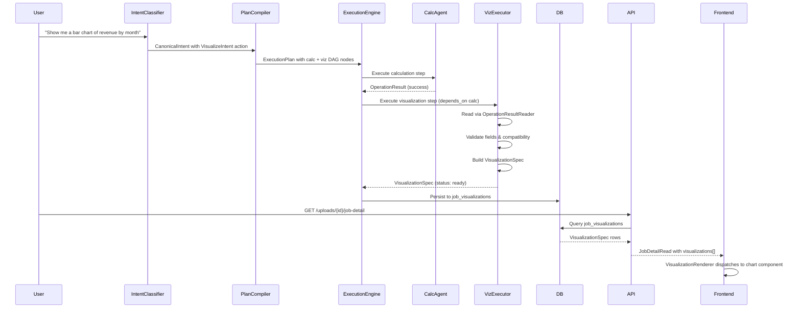

# Design Document: Chart Visualization Integration

## Overview

This design introduces an optional chart visualization layer into FinFlow's agentic pipeline. The system detects explicit visualization requests in user prompts, adds visualization DAG nodes to the execution plan, and renders charts on the frontend via Recharts — all without performing any business calculations in the visualization layer itself.

The architecture follows a strict read-only contract: the `Visualization_Executor` consumes normalized `OperationResult` payloads produced by calculation agents, maps fields to chart encodings, persists a versioned `VisualizationSpec`, and returns it for frontend rendering. Failures in visualization never affect calculation results.

### Key Design Decisions

1. **Trigger-based activation**: Visualization is opt-in via explicit trigger language in user prompts, avoiding unwanted chart clutter.
2. **DAG isolation**: Each visualization is an independent node in the execution plan with its own lifecycle, enabling failure isolation and concurrent execution.
3. **Zero-calculation principle**: The visualization layer performs only structural mapping (field selection, axis assignment, row copying) — no grouping, aggregation, or transformation.
4. **Adapter pattern**: An `OperationResultReader` decouples the visualization executor from the raw OperationResult schema, enabling independent evolution.
5. **Additive-only persistence**: A new `job_visualizations` table stores specs without altering existing tables or schemas.

## Architecture

```mermaid
flowchart TD
    subgraph Intent Classification
        A[User Prompt] --> B[Intent_Classifier]
        B -->|trigger detected| C[VisualizeIntent]
        B -->|no trigger| D[Other Intents Only]
    end

    subgraph Execution Plan
        C --> E[Plan Compiler]
        E --> F[Calculation DAG Node]
        E --> G[Visualization DAG Node]
        F -->|depends_on| G
    end

    subgraph Visualization Executor
        G --> H[OperationResultReader]
        H --> I[Field Validation]
        I --> J[Chart Compatibility Check]
        J --> K[Auto Chart Type Selection]
        K --> L[VisualizationSpec Builder]
    end

    subgraph Persistence
        L --> M[job_visualizations table]
    end

    subgraph API Layer
        M --> N[/uploads/{id}/job-detail]
        N --> O[visualizations array in response]
    end

    subgraph Frontend
        O --> P[VisualizationRenderer]
        P --> Q[LineVisualization]
        P --> R[BarVisualization]
        P --> S[PieVisualization]
        P --> T[ScatterVisualization]
        P --> U[HistogramVisualization]
    end
```

### Component Interaction Sequence



## Components and Interfaces

### 1. Trigger Language Detector

**Location**: `finflow_agent/planning/trigger_detector.py`

Responsible for detecting visualization trigger language in user prompts using case-insensitive, whole-word boundary matching.

```python
class TriggerDetector:
    TRIGGER_TERMS: set[str]  # single words: chart, graph, plot, visualize, etc.
    TRIGGER_PHRASES: list[str]  # multi-word: "as a chart", "pie chart", etc.
    ANALYTICAL_ONLY_TERMS: set[str]  # trend, distribution, compare, etc.

    def detect(self, prompt: str) -> TriggerResult:
        """
        Returns TriggerResult indicating whether visualization
        was triggered and which term/phrase matched.
        """
        ...

@dataclass
class TriggerResult:
    triggered: bool
    matched_term: str | None
    chart_type_hint: str | None  # e.g. "pie" from "pie chart"
```

### 2. OperationResultReader (Adapter)

**Location**: `finflow_agent/execution/visualization/operation_result_reader.py`

Decouples the visualization executor from the raw OperationResult payload shape.

```python
@dataclass
class FieldMetadata:
    id: str
    label: str
    data_type: Literal["string", "integer", "float", "datetime"]
    role: Literal["category", "measure", "time", "dimension"]
    unit: str | None = None
    aggregation: str | None = None

class OperationResultReader:
    def __init__(self, operation_result: dict[str, Any]):
        self._validate(operation_result)
        self._result = operation_result

    def get_fields(self) -> list[FieldMetadata]: ...
    def get_rows(self) -> list[dict[str, Any]]: ...
    def get_data_shape(self) -> DataShape: ...

    def _validate(self, result: dict) -> None:
        """Raises ValidationError if field metadata is missing/invalid."""
        ...

class DataShape(str, Enum):
    TIME_SERIES = "time_series"
    CATEGORICAL_SERIES = "categorical_series"
    HISTOGRAM_BINS = "histogram_bins"
    SCATTER_POINTS = "scatter_points"
    SCALAR = "scalar"
```

### 3. Visualization Executor

**Location**: `finflow_agent/execution/visualization/executor.py`

The core component that produces a VisualizationSpec from an OperationResult.

```python
class VisualizationExecutor:
    SUPPORTED_CHART_TYPES: set[str] = {"auto", "bar", "line", "pie", "scatter", "histogram"}
    MAX_TITLE_LENGTH: int = 200
    EXECUTION_TIMEOUT_SECONDS: int = 30

    def execute(
        self,
        operation_result: dict[str, Any],
        chart_type: str | None,
        encoding_hints: dict[str, str] | None,
        source_result_id: str,
        operation_id: str,
    ) -> VisualizationSpec:
        """
        Produces a VisualizationSpec by:
        1. Normalizing chart_type (None/empty -> "auto")
        2. Validating chart_type against supported set
        3. Reading via OperationResultReader
        4. Validating field references in encoding
        5. Running chart compatibility validation
        6. Auto-selecting chart type if "auto"
        7. Building the spec with mapped data
        """
        ...
```

### 4. Chart Compatibility Validators

**Location**: `finflow_agent/execution/visualization/validators.py`

Per-chart-type validation logic, each returning a validation result.

```python
@dataclass
class ValidationResult:
    valid: bool
    reason_code: str | None = None
    error_message: str | None = None

class ChartValidator(Protocol):
    def validate(self, reader: OperationResultReader, encoding: dict) -> ValidationResult: ...

class LineChartValidator:
    """x-axis must be time/dimension role, at least 2 distinct x values."""
    ...

class BarChartValidator:
    """At least one category/dimension field + one numeric field, at least 1 row."""
    ...

class PieChartValidator:
    """Exactly 1 category + 1 numeric, all values >= 0, max N categories."""
    ...

class ScatterChartValidator:
    """2 numeric fields, at least 2 rows with non-null values in both."""
    ...

class HistogramChartValidator:
    """At least one measure field with frequencies, at least 1 row of bin data."""
    ...
```

### 5. VisualizationSpec Model

**Location**: `finflow_agent/execution/visualization/spec.py`

```python
class VisualizationSpec(BaseModel):
    schema_version: str = "1.0"
    visualization_id: str  # UUID
    operation_id: str
    source_result_id: str
    status: Literal["ready", "unsupported", "failed"]
    chart_type: str
    title: str  # max 200 chars
    encoding: dict[str, str]  # axis_role -> field_id
    data: list[dict[str, Any]]  # row objects
    options: dict[str, Any] = Field(default_factory=dict)
    warnings: list[str] = Field(default_factory=list, max_length=20)
    error: str | None = None
```

### 6. Database Model (Backend)

**Location**: `backend/app/models/visualization.py`

```python
class JobVisualization(Base):
    __tablename__ = "job_visualizations"
    __table_args__ = (
        UniqueConstraint("job_id", "operation_id", name="uq_job_viz_job_op"),
    )

    id: Mapped[uuid.UUID] = mapped_column(UUID(as_uuid=True), primary_key=True, default=uuid.uuid4)
    job_id: Mapped[uuid.UUID] = mapped_column(
        UUID(as_uuid=True),
        ForeignKey("submissions.id", ondelete="CASCADE"),
        nullable=False,
    )
    operation_id: Mapped[str] = mapped_column(String(255), nullable=False)
    spec: Mapped[dict] = mapped_column(JSONB, nullable=False)
    data: Mapped[dict | None] = mapped_column(JSONB, nullable=True)
    created_at: Mapped[datetime] = mapped_column(
        DateTime(timezone=True), nullable=False, server_default=func.now()
    )
```

### 7. API Integration

**Location**: Modified `backend/app/api/uploads.py` and `backend/app/schemas/__init__.py`

The `JobDetailRead` schema gains a `visualizations` field:

```python
class VisualizationSpecRead(BaseModel):
    schema_version: str
    visualization_id: str
    operation_id: str
    source_result_id: str
    status: str
    chart_type: str
    title: str
    encoding: dict = Field(default_factory=dict)
    data: list[dict] = Field(default_factory=list)
    options: dict = Field(default_factory=dict)
    warnings: list[str] = Field(default_factory=list)
    error: str | None = None

class JobDetailRead(BaseModel):
    # ... existing fields unchanged ...
    visualizations: list[VisualizationSpecRead] = Field(default_factory=list)
```

### 8. Frontend Components

**Location**: `frontend/src/components/visualization/`

```
visualization/
├── VisualizationRenderer.jsx    # Dispatcher based on chart_type
├── LineVisualization.jsx         # Recharts LineChart wrapper
├── BarVisualization.jsx          # Recharts BarChart wrapper
├── PieVisualization.jsx          # Recharts PieChart wrapper
├── ScatterVisualization.jsx      # Recharts ScatterChart wrapper
├── HistogramVisualization.jsx    # Recharts BarChart (histogram mode) wrapper
├── UnsupportedState.jsx          # Error/unsupported display
└── index.js                      # Barrel export
```

```jsx
// VisualizationRenderer.jsx
function VisualizationRenderer({ spec }) {
  if (spec.status === "unsupported") return <UnsupportedState message={spec.error} />;
  if (spec.status === "failed") return <UnsupportedState message={spec.error} variant="error" />;

  const chartMap = {
    line: LineVisualization,
    bar: BarVisualization,
    pie: PieVisualization,
    scatter: ScatterVisualization,
    histogram: HistogramVisualization,
  };

  const ChartComponent = chartMap[spec.chart_type];
  if (!ChartComponent) return <UnsupportedState message={`Chart type "${spec.chart_type}" is not supported`} />;

  return <ChartComponent spec={spec} />;
}
```

## Data Models

### VisualizationSpec (Contract)

```json
{
  "schema_version": "1.0",
  "visualization_id": "uuid-string",
  "operation_id": "calc_step_1",
  "source_result_id": "result_uuid",
  "status": "ready | unsupported | failed",
  "chart_type": "bar",
  "title": "Revenue by Month",
  "encoding": {
    "x": "month_field_id",
    "y": "revenue_field_id"
  },
  "data": [
    {"month_field_id": "Jan", "revenue_field_id": 42000},
    {"month_field_id": "Feb", "revenue_field_id": 51000}
  ],
  "options": {},
  "warnings": [],
  "error": null
}
```

### FieldMetadata

```json
{
  "id": "revenue",
  "label": "Monthly Revenue",
  "data_type": "float",
  "role": "measure",
  "unit": "USD",
  "aggregation": "sum"
}
```

### DataShape Classification Logic

| Condition | data_shape |
|-----------|-----------|
| Any field has role "time" | `time_series` |
| At least one "category" + one "measure" field | `categorical_series` |
| Fields represent precomputed bin boundaries + frequencies | `histogram_bins` |
| Exactly 2 numeric measure fields, no category field | `scatter_points` |
| Otherwise | `scalar` |

### Auto Chart Type Mapping

| data_shape | Selected chart_type |
|------------|-------------------|
| `time_series` | `line` |
| `categorical_series` | `bar` |
| `histogram_bins` | `histogram` |
| `scatter_points` | `scatter` |
| No match / `scalar` | `bar` (default) |

Note: `pie` is never auto-selected.

### Database Schema (job_visualizations)

| Column | Type | Constraints |
|--------|------|------------|
| id | UUID | PK, default uuid4 |
| job_id | UUID | FK → submissions.id, CASCADE on delete, NOT NULL |
| operation_id | VARCHAR(255) | NOT NULL |
| spec | JSONB | NOT NULL |
| data | JSONB | nullable |
| created_at | TIMESTAMP WITH TIME ZONE | NOT NULL, server default now() |

**Unique constraint**: `(job_id, operation_id)`
**Upsert behavior**: On conflict, update spec, data, and created_at.

### Execution Engine Extensions

The `ExecutionEngine` gains:
- A `MAX_VISUALIZATIONS_PER_JOB = 20` constant
- Plan validation rejecting plans with >20 visualization nodes
- A new `kind="visualization"` handling path in the node executor
- `completed_with_warnings` job status when calc succeeds but viz fails
- Visualization DAG node timeout of 30 seconds


## Correctness Properties

*A property is a characteristic or behavior that should hold true across all valid executions of a system — essentially, a formal statement about what the system should do. Properties serve as the bridge between human-readable specifications and machine-verifiable correctness guarantees.*

### Property 1: Trigger Language Detection

*For any* user prompt that contains at least one Trigger_Language term (as a case-insensitive whole-word match or exact multi-word phrase), the Intent_Classifier SHALL produce a VisualizeIntent action in the canonical intent, regardless of the presence of other analytical terms in the same prompt.

**Validates: Requirements 1.1, 1.4**

### Property 2: No False Trigger from Analytical-Only Prompts

*For any* user prompt composed exclusively of analytical terms (trend, distribution, compare, breakdown, summary, overview, analysis) with no Trigger_Language term present, the Intent_Classifier SHALL NOT produce a VisualizeIntent action.

**Validates: Requirements 1.2**

### Property 3: Whole-Word Boundary Matching

*For any* user prompt where Trigger_Language terms appear only as substrings within larger words (e.g., "uncharted", "graphite", "plotter") or where multi-word phrase components appear non-contiguously, the Intent_Classifier SHALL NOT produce a VisualizeIntent action.

**Validates: Requirements 1.3, 1.5**

### Property 4: Zero-Calculation Invariant

*For any* valid OperationResult and chart configuration, every value present in the resulting VisualizationSpec's data array SHALL exist verbatim (same type, same precision, same encoding) in the source OperationResult's rows — no values in the output may be derived, computed, rounded, or synthesized by the Visualization_Executor.

**Validates: Requirements 3.1, 3.2, 3.4, 18.2**

### Property 5: Source Immutability

*For any* OperationResult consumed by the Visualization_Executor, the OperationResult's values, row order, row count, and field metadata in PipelineState SHALL be identical before and after the Visualization_Executor's execution completes.

**Validates: Requirements 4.1, 4.2**

### Property 6: Failure Isolation — Calculation Status Preserved

*For any* job where a calculation step completes with status "success", if the dependent visualization DAG_Node subsequently throws an exception, times out, or returns status "unsupported" or "failed", the calculation step's status SHALL remain "success" in the execution results.

**Validates: Requirements 6.1**

### Property 7: Job Status Rules

*For any* job execution: (a) if all calculation steps succeed and one or more visualization nodes fail, the overall job status SHALL be "completed_with_warnings"; (b) if any calculation step fails, the overall job status SHALL be "failed" regardless of visualization outcomes.

**Validates: Requirements 6.2, 6.4**

### Property 8: Auto Chart Type Selection Determinism

*For any* OperationResult with chart_type "auto", the Visualization_Executor SHALL select the chart type deterministically based on data_shape (time_series→line, categorical_series→bar, histogram_bins→histogram, scatter_points→scatter, no match→bar), SHALL never select "pie", and SHALL record the resolved chart type (not "auto") in the VisualizationSpec chart_type field.

**Validates: Requirements 7.1, 7.2, 7.3, 7.4**

### Property 9: Chart Compatibility Validation

*For any* chart_type and OperationResult combination, the Visualization_Executor SHALL correctly validate compatibility according to the chart-specific rules (line: time/dimension x-axis with ≥2 distinct values; bar: category/dimension + numeric with ≥1 row; pie: exactly 1 category + 1 numeric with all values ≥0 and ≤max categories; scatter: 2 numeric fields with ≥2 non-null rows; histogram: measure field with ≥1 bin row), excluding rows with null values in required fields from minimum-row-count checks.

**Validates: Requirements 8.1, 8.2, 8.3, 8.4, 8.5, 8.6, 8.7**

### Property 10: VisualizationSpec Structural Contract

*For any* VisualizationSpec produced by the Visualization_Executor: (a) schema_version SHALL be "1.0"; (b) if status is "ready", data SHALL contain ≥1 row and encoding SHALL map ≥1 axis role to a valid field ID; (c) if status is "unsupported" or "failed", error SHALL be a non-null string, data SHALL be an empty array, and encoding SHALL be an empty object; (d) title SHALL be a non-empty string of at most 200 characters for all status values.

**Validates: Requirements 9.1, 9.2, 9.3, 9.4, 9.5, 18.4**

### Property 11: Chart Type Acceptance

*For any* chart_type string, the Visualization_Executor SHALL accept it if and only if it is one of the case-sensitive lowercase values {"auto", "bar", "line", "pie", "scatter", "histogram"}; for any string outside this set (including uppercase/mixed-case variants), it SHALL set status to "unsupported" with reason_code "unsupported_chart_type"; for null, empty, or missing values it SHALL treat chart_type as "auto".

**Validates: Requirements 15.1, 15.2, 15.3, 15.4**

### Property 12: Field Validation Correctness

*For any* encoding object and OperationResult field metadata, the Visualization_Executor SHALL validate that: (a) every field ID in the encoding exists in the source field metadata; (b) fields on the measure axis have data_type "integer" or "float"; (c) fields on the time axis have data_type "datetime" or role "time"; (d) fields on the category axis have role "category" or "dimension". If any validation fails, status SHALL be "unsupported" with reason_code "invalid_field_reference" and all failing field IDs listed in the error message.

**Validates: Requirements 17.1, 17.2, 17.3, 17.4, 17.5**

### Property 13: OperationResultReader Data Shape Classification

*For any* valid OperationResult, the OperationResultReader SHALL classify data_shape correctly: time_series if any field has role "time"; categorical_series if fields include at least one "category" and one "measure"; histogram_bins if fields represent bin boundaries and frequencies; scatter_points if exactly two numeric measure fields exist with no category; scalar otherwise.

**Validates: Requirements 14.1**

### Property 14: Visualization Count Limit

*For any* execution plan, the Execution_Engine SHALL accept plans with 0 to 20 visualization DAG_Nodes inclusive and SHALL reject plans with more than 20 visualization DAG_Nodes.

**Validates: Requirements 5.1, 5.5**

### Property 15: Per-Node Isolation and Ordering

*For any* job with N visualization DAG_Nodes (1 ≤ N ≤ 20), the system SHALL produce exactly N VisualizationSpecs — one per node regardless of other nodes' success or failure — and SHALL return them ordered by their topological position in the execution plan.

**Validates: Requirements 5.3, 5.4, 6.3**

### Property 16: Error Message Format

*For any* VisualizationSpec with status "unsupported", the error field SHALL contain a plain-language string of 1 to 500 characters that describes the incompatibility without exposing internal codes or stack traces.

**Validates: Requirements 18.1**

### Property 17: Frontend Dispatch Correctness

*For any* VisualizationSpec with status "ready" and a valid chart_type, the VisualizationRenderer SHALL dispatch rendering to the corresponding subcomponent (line→LineVisualization, bar→BarVisualization, pie→PieVisualization, scatter→ScatterVisualization, histogram→HistogramVisualization) and SHALL use encoding field IDs as Recharts dataKey values.

**Validates: Requirements 12.1, 12.2**

## Error Handling

### Visualization Executor Errors

| Error Condition | Status | reason_code | Behavior |
|----------------|--------|-------------|----------|
| Unsupported chart_type value | `unsupported` | `unsupported_chart_type` | Return spec with empty data/encoding |
| Field ID in encoding not found in source | `unsupported` | `invalid_field_reference` | List all missing fields in error |
| Field type mismatch for axis role | `unsupported` | `invalid_field_reference` | List all mismatched fields in error |
| Chart compatibility validation failure | `unsupported` | `{chart_type}_incompatible_{condition}` | Identify specific failed condition |
| Source OperationResult missing | `failed` | `source_result_missing` | Cannot proceed |
| Source OperationResult lacks valid field metadata | `failed` | `invalid_source_data` | OperationResultReader validation error |
| Source data mutated during execution | `failed` | `source_data_mutated` | Abort, do not persist data |
| Unhandled exception in executor | `failed` | `internal_error` | Catch-all, log internally |
| Execution timeout (30s) | `failed` | `execution_timeout` | Engine kills the node |

### Execution Engine Error Handling

| Condition | Job Status | Behavior |
|-----------|-----------|----------|
| All steps succeed (calc + viz) | `complete` | Normal completion |
| All calc succeed, ≥1 viz fails | `completed_with_warnings` | Calc results preserved, failed viz specs persisted |
| ≥1 calc step fails | `failed` | Regardless of viz outcomes |
| Plan has >20 viz nodes | Plan rejected | Error before execution starts |
| Viz depends on >1 calc step | Plan rejected | Error before execution starts |
| Viz depends_on unresolvable | Viz node `failed` | Other nodes continue |

### API Error Handling

| Condition | HTTP Status | Behavior |
|-----------|-------------|----------|
| DB query for visualizations fails | 200 | Return `visualizations: []` + warning in response |
| Invalid visualization_id in query | 200 | Skip invalid rows, return valid ones |
| Job has no visualizations | 200 | Return `visualizations: []` |

### Frontend Error Handling

| Condition | UI Behavior |
|-----------|-------------|
| spec.status === "unsupported" | Display error message in info-state container |
| spec.status === "failed" | Display error message in error-state container |
| Unknown chart_type | Display "Chart type not supported" message |
| Empty data array with "ready" status | Display "No data available" message |
| Network error fetching job detail | Existing error boundary handles it |

## Testing Strategy

### Unit Tests (Example-Based)

Unit tests cover specific examples, edge cases, integration points, and error conditions:

- **Trigger detection edge cases**: "uncharted" not triggering, "Pie CHART" triggering (case-insensitive), multi-word phrase matching
- **Chart validation boundary conditions**: exactly 2 vs 1 scatter rows, pie with exactly max categories, bar with 0 rows
- **VisualizationSpec construction**: correct title generation, correct schema_version, field mapping
- **Error formatting**: reason_code construction, error message length capping at 500 chars
- **API response shape**: backward compatibility with pre-viz jobs, empty visualizations array
- **Frontend rendering**: snapshot tests for each chart subcomponent, unsupported state display

### Property-Based Tests

Property-based testing is appropriate for this feature because:
- The trigger detection logic operates over a large input space (arbitrary prompts)
- Chart validation has universal rules that should hold for all valid/invalid OperationResults
- The zero-calculation and immutability invariants must hold for ANY data shape and size
- Data shape classification is a pure function from field metadata

**Library**: [Hypothesis](https://hypothesis.readthedocs.io/) (Python, for backend/agent-framework)

**Configuration**: Minimum 100 iterations per property test.

**Tag format**: `Feature: chart-visualization-integration, Property {number}: {property_text}`

Each correctness property (1–17) maps to a single property-based test:

| Property | Test Target | Generator Strategy |
|----------|-------------|-------------------|
| P1: Trigger detection | `TriggerDetector.detect()` | Random prompts + injected trigger terms |
| P2: No false triggers | `TriggerDetector.detect()` | Random prompts from analytical terms only |
| P3: Whole-word boundary | `TriggerDetector.detect()` | Words containing trigger substrings |
| P4: Zero-calculation | `VisualizationExecutor.execute()` | Random valid OperationResults + chart configs |
| P5: Source immutability | `VisualizationExecutor.execute()` | Deep-copied OperationResults |
| P6: Failure isolation | `ExecutionEngine.execute()` | Plans with succeeding calcs + failing viz |
| P7: Job status rules | `ExecutionEngine.execute()` | Plans with mixed calc/viz outcomes |
| P8: Auto selection | `VisualizationExecutor.execute()` | Random OperationResults with chart_type="auto" |
| P9: Chart compatibility | Per-chart validators | Random field metadata + row data |
| P10: Spec contract | `VisualizationExecutor.execute()` | All execution paths |
| P11: Chart type acceptance | `VisualizationExecutor.execute()` | Random strings + supported set |
| P12: Field validation | `VisualizationExecutor.execute()` | Random encodings + field metadata |
| P13: Data shape classification | `OperationResultReader.get_data_shape()` | Random field configurations |
| P14: Viz count limit | `ExecutionEngine` plan validation | Plans with 0..25 viz nodes |
| P15: Per-node isolation | `ExecutionEngine.execute()` | Multi-viz plans with mixed outcomes |
| P16: Error message format | `VisualizationExecutor.execute()` | Incompatible chart/data pairs |
| P17: Frontend dispatch | `VisualizationRenderer` | Random valid specs with all chart types |

### Integration Tests

- **Database round-trip**: Insert and query `job_visualizations`, verify upsert behavior
- **API endpoint**: Call `/uploads/{id}/job-detail` with viz data, verify response shape
- **Alembic migration**: Run upgrade/downgrade, verify table creation/removal
- **End-to-end pipeline**: Submit a job with visualization intent, verify spec appears in API response
- **Backward compatibility**: Verify existing jobs return unchanged responses with `visualizations: []`

### Frontend Tests (React Testing Library + Vitest)

- **Component rendering**: Each chart subcomponent renders correctly with valid spec data
- **Error states**: Unsupported and failed specs render appropriate messages
- **Theme compliance**: Verify ff-* class prefixes are applied
- **DataKey binding**: Verify Recharts components receive correct dataKey props from encoding
