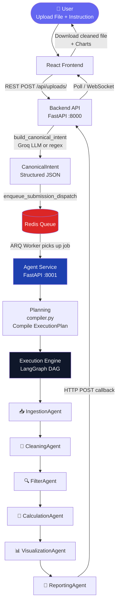
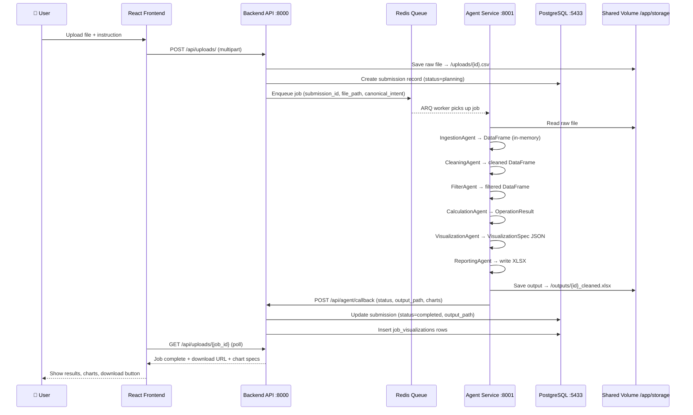

# 🧹 LedgerFlow — Agentic Data Cleaning Platform

A full-stack, AI-powered data cleaning platform. Upload messy spreadsheets or CSVs, let an LLM-backed agent pipeline clean them, review and approve the changes, then download production-ready files — all through a modern web UI.

---

## 📐 Architecture Overview

```
┌─────────────────────────────────────────────────────────┐
│                      Browser (React)                    │
│              frontend  ·  port 5173                     │
└───────────────────────┬─────────────────────────────────┘
                        │ REST / WebSocket
┌───────────────────────▼─────────────────────────────────┐
│               Backend API (FastAPI)                     │
│              backend   ·  port 8000                     │
│  auth · uploads · agent-dispatch · analytics · alerts  │
└────────────┬───────────────────────┬────────────────────┘
             │ PostgreSQL            │ Redis (job queue)
┌────────────▼──────────┐   ┌───────▼────────────────────┐
│  postgres  · port 5433│   │  Agent Service (FastAPI)   │
│  (persistent data)    │   │  agent-framework · port 8001│
└───────────────────────┘   │  LLM pipeline · Groq API   │
                            └────────────────────────────┘
```

| Service | Technology | Port |
|---|---|---|
| **Frontend** | React 19, Vite, TailwindCSS, Recharts | `5173` |
| **Backend API** | FastAPI, SQLAlchemy (async), Alembic | `8000` |
| **Agent Service** | FastAPI, Groq LLM, custom pipeline | `8001` |
| **Database** | PostgreSQL 16 | `5433` |
| **Queue / Cache** | Redis 7 | `6379` |

---

## ✨ Features

- **File ingestion** — Upload `.csv`, `.xlsx`, or `.pdf` files via drag-and-drop
- **Agentic cleaning pipeline** — LLM (Groq) plans and executes multi-step data cleaning operations (deduplication, normalisation, type coercion, etc.)
- **Human-in-the-loop** — Agents request clarification from users when intent is ambiguous; users approve or reject cleaning proposals
- **Real-time progress** — WebSocket-powered live status updates while the agent works
- **Analytics dashboard** — Charts and summaries of cleaning runs (Recharts)
- **Audit trail** — Full log of all agent operations per job
- **Alerts** — Configurable threshold alerts on cleaned data
- **Comments** — Per-job comment threads
- **Role-based access** — `admin` and `employee` roles; manager ↔ employee reporting lines
- **JWT auth** — Secure cookie-based authentication

---

## 🗂️ Project Structure

```
COMBINED CLEANING/
├── backend/                   # FastAPI backend
│   ├── app/
│   │   ├── api/               # Route handlers
│   │   │   ├── auth.py        # Login, register, token refresh
│   │   │   ├── uploads.py     # File upload & job management
│   │   │   ├── agent.py       # Agent dispatch & callbacks
│   │   │   ├── analytics.py   # Dashboard analytics
│   │   │   ├── approvals.py   # Human approval flow
│   │   │   ├── clarification.py
│   │   │   ├── alerts.py
│   │   │   ├── comments.py
│   │   │   ├── audit.py
│   │   │   ├── admin.py
│   │   │   └── websockets.py
│   │   ├── core/              # Config, security, settings
│   │   ├── db/                # DB session, base
│   │   ├── models/            # SQLAlchemy ORM models
│   │   ├── schemas/           # Pydantic schemas
│   │   └── services/          # Business logic & dispatchers
│   ├── alembic/               # DB migrations
│   ├── requirements.txt
│   ├── Dockerfile
│   └── .env                   # Backend secrets (see below)
│
├── agent-framework/
│   └── new-agentic-project-data-cleaning-/
│       ├── src/finflow_agent/
│       │   ├── agents/        # Individual specialist agents
│       │   ├── pipeline/      # Orchestration pipeline
│       │   ├── planning/      # LLM-based plan generation
│       │   ├── operations/    # Data cleaning operations
│       │   ├── grounding/     # Intent grounding / normalisation
│       │   ├── execution/     # Plan executor
│       │   ├── tools/         # Agent tools
│       │   ├── llm.py         # Groq LLM client
│       │   ├── registry.py    # Contract & capability registry
│       │   └── api.py         # HTTP API exposed to backend
│       ├── requirements.txt
│       ├── Dockerfile
│       └── .env               # Agent secrets (Groq key, etc.)
│
├── frontend/                  # React frontend
│   ├── src/
│   ├── package.json
│   ├── tailwind.config.js
│   └── Dockerfile
│
├── database/                  # DB seed / init scripts
├── docs/                      # Additional documentation
└── docker-compose.yml         # Orchestrates all services
```

---

## 🚀 Quick Start (Docker — recommended)

### Prerequisites
- [Docker Desktop](https://www.docker.com/products/docker-desktop/) ≥ 4.x

### 1. Clone the repo

```bash
git clone <your-repo-url>
cd "COMBINED CLEANING"
```

### 2. Create the backend `.env` file

```bash
touch backend/.env
```

All core environment variables are already declared in `docker-compose.yml`. Add any extra secrets to `backend/.env` if needed (e.g. a custom `JWT_SECRET_KEY`).

### 3. Configure the agent `.env`

Edit `agent-framework/new-agentic-project-data-cleaning-/.env` and set your **Groq API key**:

```env
GROQ_API_KEY=your_groq_api_key_here
```

> Get a free key at [console.groq.com](https://console.groq.com)

### 4. Start everything

```bash
docker compose up --build
```

| Service | URL |
|---|---|
| Frontend | http://localhost:5173 |
| Backend API | http://localhost:8000 |
| API docs (Swagger) | http://localhost:8000/docs |
| Agent Service | http://localhost:8001 |
| Health check | http://localhost:8000/health |

### Default credentials (dev mode)

| Role | Email | Password |
|---|---|---|
| Admin | `kukretimanas8@gmail.com` | *(set in config)* |
| Employee | `employee@gmail.com` | *(set in config)* |

---

## 🛠️ Local Development (without Docker)

### Backend

```bash
cd backend
python -m venv .venv
source .venv/bin/activate
pip install -r requirements.txt

# Run DB migrations
alembic upgrade head

# Start the API server
uvicorn app.main:app --reload --port 8000
```

### Agent Service

```bash
cd agent-framework/new-agentic-project-data-cleaning-
python -m venv .venv
source .venv/bin/activate
pip install -r requirements.txt

uvicorn src.finflow_agent.api:app --reload --port 8001
```

### Frontend

```bash
cd frontend
npm install
npm run dev
```

---

## ⚙️ Environment Variables

### `backend/.env`

| Variable | Description | Default (compose) |
|---|---|---|
| `DATABASE_URL` | PostgreSQL connection string | set in compose |
| `REDIS_URL` | Redis connection string | set in compose |
| `JWT_SECRET_KEY` | Secret for signing JWTs | `change-this-before-production` |
| `CORS_ORIGINS` | Allowed frontend origins | `http://localhost:5173` |
| `AGENT_BASE_URL` | Internal URL for agent service | `http://agent-service:8001` |
| `AGENT_REGISTRY_SECRET` | Shared secret for agent auth | set in compose |

### `agent-framework/.../.env`

| Variable | Description |
|---|---|
| `GROQ_API_KEY` | **Required.** Your Groq API key |
| `DATABASE_URL` | PostgreSQL connection string |
| `REDIS_URL` | Redis connection string |
| `BACKEND_BASE_URL` | URL the agent posts callbacks to |
| `AGENT_CALLBACK_SECRET` | Shared secret for callback auth |

---

## 🧪 Running Tests

### Backend

```bash
cd backend
pytest tests/
```

### Frontend

```bash
cd frontend
npm run test
```

### Agent Framework

```bash
cd agent-framework/new-agentic-project-data-cleaning-
pytest tests/
```

---

## 🐳 Docker Services Reference

```bash
# Start in background
docker compose up -d --build

# View logs for a specific service
docker compose logs -f backend
docker compose logs -f agent-service

# Stop all services
docker compose down

# Wipe volumes (database + storage)
docker compose down -v
```

---

## 📡 Key API Endpoints

| Method | Path | Description |
|---|---|---|
| `POST` | `/api/auth/login` | Login, returns JWT cookie |
| `POST` | `/api/uploads/` | Upload a file, creates a job |
| `GET` | `/api/uploads/` | List all jobs |
| `GET` | `/api/uploads/{job_id}` | Get job details + status |
| `POST` | `/api/agent/dispatch/{job_id}` | Trigger agent cleaning |
| `POST` | `/api/approvals/{job_id}` | Approve/reject cleaning result |
| `GET` | `/api/analytics/summary` | Dashboard analytics |
| `GET` | `/health` | Service health check |

Full interactive docs available at **http://localhost:8000/docs** when running.

---

## 🤖 Agent Workflow & Pipeline

LedgerFlow uses a **multi-agent pipeline** orchestrated via a LangGraph DAG. Each user instruction is translated into a structured `ExecutionPlan` and executed step-by-step through specialist agents.

---

### 🗺️ Orchestrator: High-Level Flow



---

### 🔬 Semantic Pipeline (Orchestrator Internals)

Before the DAG runs, the **Pipeline Orchestrator** (`pipeline/orchestrator.py`) processes the user intent through a series of semantic stages:

```mermaid
flowchart LR
    NL[Natural Language\nInstruction] --> SE[SemanticExtractor\nLLM → IntentDraft]
    SE --> CV[CoverageValidator\nCheck column coverage]
    CV --> SR[SemanticRepair\nFix incomplete drafts]
    SR --> COORD[IntentResolutionCoordinator\nClassify operation type\nfilter / sort / drop / rename]
    COORD --> PL[PreflightDataLoader\nLoad + profile data]
    PL --> SS[SchemaService\nInfer column roles\ndate / numeric / category]
    SS --> CG[CandidateGenerator\nRanked column matches]
    CG --> CLG[ColumnGrounder\nResolve column references]
    CLG --> PG[PredicateGrounder\nGround filter predicates]
    PG --> CANON[Canonicalizer\nProduce CanonicalIntent]
    CANON --> COMPILER[Compiler\nBuild ExecutionPlan]
    COMPILER --> DAG[LangGraph DAG\nExecute Agents]

    style NL fill:#7c3aed,color:#fff
    style DAG fill:#059669,color:#fff
    style COMPILER fill:#d97706,color:#fff
```



---

### 🧩 Agent Breakdown

Each agent is a **single-responsibility** specialist registered in the Agent Registry and executed in topological order.

```mermaid
flowchart TD
    subgraph INGEST["📥 IngestionAgent  (stage: ingest)"]
        direction TB
        IA_IN["Input: file path + file_type"] --> IA_OP["Parse CSV / XLSX / PDF\nvia pandas / pdfplumber"]
        IA_OP --> IA_OUT["Output: DataFrame"]
        IA_TOOLS["🔧 Tools Used\n• path_safety.py — directory traversal guard\n• pandas.read_csv / read_excel\n• pdfplumber (PDF table extraction)"]
    end

    subgraph CLEAN["🧹 CleaningAgent  (stage: transform)"]
        direction TB
        CA_IN["Input: DataFrame"] --> CA_OP["Execute CleaningOperationPlan\n19 cleaning handlers"]
        CA_OP --> CA_OUT["Output: cleaned DataFrame\n+ audit log entries"]
        CA_TOOLS["🔧 Tools Used\n• cleaning_handlers.py (19 ops)\n• operations/executor.py\n• LLM plan generation via llm.py\n• column_resolver.py (fuzzy match)\nModes: 'clean' | 'filter_prep'"]
    end

    subgraph FILTER["🔍 FilterAgent  (stage: transform)"]
        direction TB
        FA_IN["Input: DataFrame + FilterPlan"] --> FA_OP["Apply row filter predicates\n15 operators supported"]
        FA_OP --> FA_OUT["Output: filtered DataFrame"]
        FA_TOOLS["🔧 Tools Used\n• predicate_grounder.py — semantic column resolution\n• value_resolver.py — check value existence in data\n• column_resolver.py — fuzzy column matching\n• filter_handlers.py (eq, gt, lt, contains, in…)\n• dataframe_profile.py — data profiling"]
    end

    subgraph CALC["🔢 CalculationAgent  (stage: analyze)"]
        direction TB
        CALC_IN["Input: DataFrame"] --> CALC_OP["Execute CalculationOperationPlan\n23 calculation handlers"]
        CALC_OP --> CALC_OUT["Output: OperationResult\n(summary table / scalar)"]
        CALC_TOOLS["🔧 Tools Used\n• calculation_handlers.py (23 ops)\n• operations/executor.py\n• result_builder.py — normalize handler output\n• result_contract.py — OperationResult schema"]
    end

    subgraph VIZ["📊 VisualizationAgent  (stage: visualize)"]
        direction TB
        VA_IN["Input: DataFrame / OperationResult"] --> VA_OP["Map data → VisualizationSpec\n(pie, bar, line, scatter, histogram)"]
        VA_OP --> VA_OUT["Output: VisualizationSpec JSON"]
        VA_TOOLS["🔧 Tools Used\n• execution/visualization/executor.py\n• execution/visualization/validators.py\n• execution/visualization/spec.py\n• Feature flag: ENABLE_VISUALIZATION"]
    end

    subgraph REPORT["📄 ReportingAgent  (stage: deliver)"]
        direction TB
        RA_IN["Input: cleaned / filtered DataFrame"] --> RA_OP["Write output file\n(XLSX multi-sheet or CSV/JSON)"]
        RA_OP --> RA_OUT["Output: file path on shared volume\n5-sheet XLSX audit workbook"]
        RA_TOOLS["🔧 Tools Used\n• reporting_handlers.py\n  → write_excel_with_audit_sheets()\n• operations/executor.py\nSheets: cleaned_data, filtered_data,\naudit_log, warnings, column_mapping"]
    end

    INGEST --> CLEAN --> FILTER --> CALC --> VIZ --> REPORT
```



---

### 🛠️ Shared Tools & Utilities

| Tool / Module | Used By | Purpose |
|---|---|---|
| `tools/column_resolver.py` | Cleaning, Filter | Fuzzy column name matching (handles typos & abbreviations) |
| `tools/predicate_grounder.py` | Filter | Semantic resolution of filter predicates against real column data |
| `tools/value_resolver.py` | Filter | Validates that filter values actually exist in a column |
| `tools/dataframe_profile.py` | Filter, Pipeline | Profiles DataFrame: types, nulls, distinct values, semantic type guesses |
| `tools/path_safety.py` | Ingestion | Prevents directory traversal attacks on file paths |
| `tools/config.py` | Visualization | Feature flags (`ENABLE_VISUALIZATION`, confidence thresholds) |
| `llm.py` | Planning, Cleaning | All Groq API calls (`call_groq_json()`, role normalization) |
| `llm_telemetry.py` | All agents | Structured logging for every LLM call (timing, tokens, errors) |
| `registry.py` | All agents | Agent Registry singleton; `@registry.register` decorator |
| `operations/executor.py` | Cleaning, Filter, Calc | Dispatches cleaning / filter / calculation / reporting plans |

---

### 📊 Supported Operations at a Glance

| Category | Count | Examples |
|---|---|---|
| **Cleaning** | 19 handlers | `trim_whitespace`, `drop_duplicates`, `normalize_date`, `fill_nulls`, `absolute_value`, `normalize_categorical_values` |
| **Filtering** | 15 operators | `eq`, `gt`, `lt`, `contains`, `between`, `in`, `is_null`, `starts_with` |
| **Calculation** | 23 handlers | `sum`, `mean`, `group_sum`, `cross_tab_sum`, `conditional_percentage`, `quarterly_sum` |
| **Visualization** | 5 chart types | `pie`, `bar`, `line`, `scatter`, `histogram` |

---

### 🔄 Data Flow Through the System



---

## 🤝 Contributing

1. Fork the repo
2. Create a feature branch: `git checkout -b feat/my-feature`
3. Commit your changes: `git commit -m "feat: add my feature"`
4. Push and open a Pull Request

---

## 📄 License

This project is private. All rights reserved.
